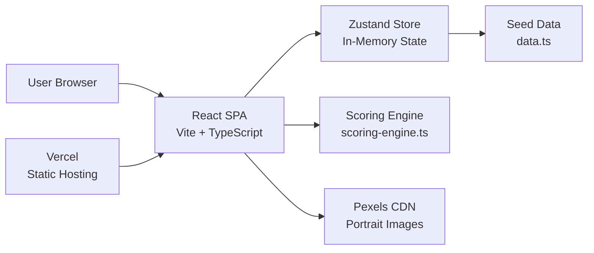
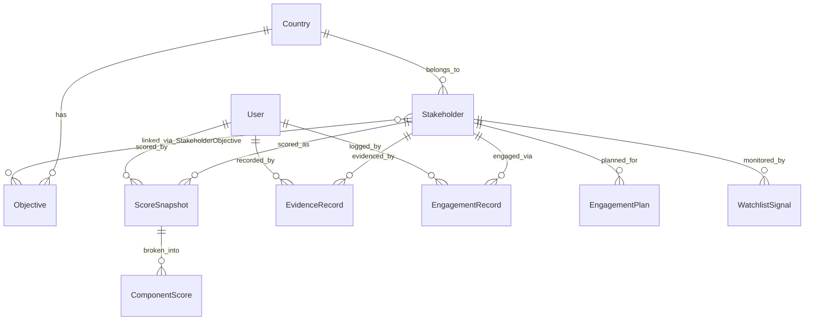
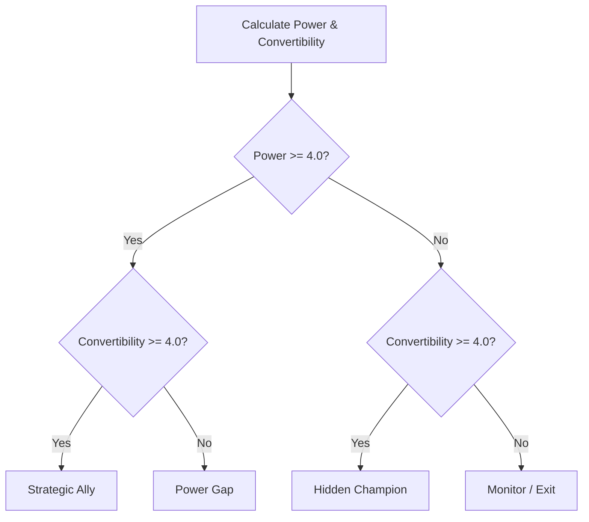
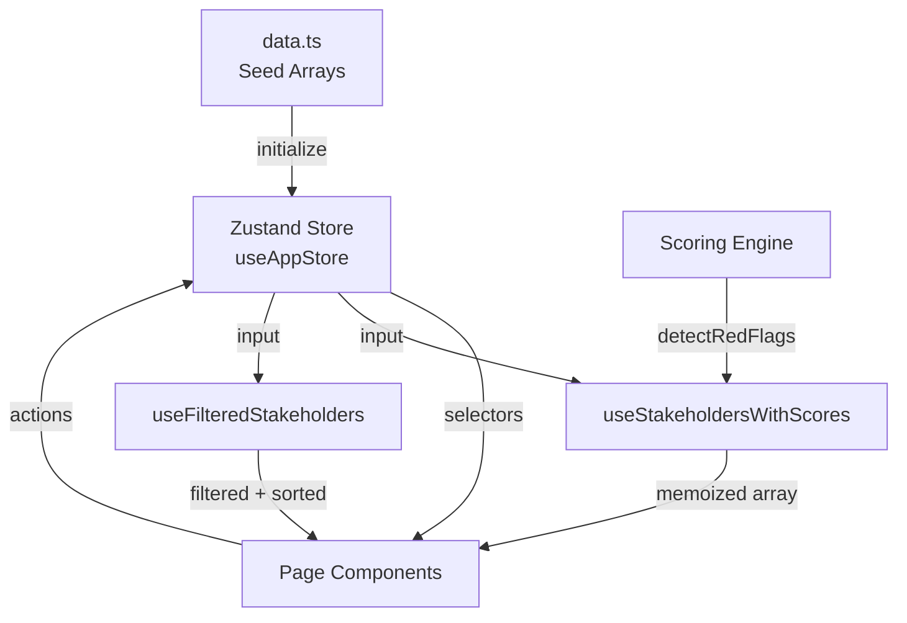

# MSIT v1 Technical Documentation

**Momentum Stakeholder Intelligence Tool**

| Field | Value |
|-------|-------|
| Version | 1.0 (commit c3c791f) |
| Stack | React 19 + TypeScript 6 + Vite 8 + Tailwind CSS 4 + Zustand 5 + Recharts 3 |
| Live URL | https://msit-intel.vercel.app |
| Repository | https://github.com/Ultron254/MSIT-Stakeholder-Intelligence |
| Last Updated | May 18, 2026 |

---

## Table of Contents

- [System Overview](#system-overview)
- [Repository Structure](#repository-structure)
- [Data Model](#data-model)
  - [Entity Relationship Diagram](#entity-relationship-diagram)
  - [Entity Reference](#entity-reference)
  - [Type Unions and Constants](#type-unions-and-constants)
  - [Quadrant Color Coding](#quadrant-color-coding)
- [Scoring Engine](#scoring-engine)
  - [SIS (Stakeholder Intelligence Score)](#sis-stakeholder-intelligence-score)
  - [Quadrant Axes](#quadrant-axes)
  - [Quadrant Classification](#quadrant-classification)
  - [Worked Example](#worked-example)
  - [Red Flag Detection](#red-flag-detection)
  - [SIS Tier Coloring](#sis-tier-coloring)
  - [Confidence](#confidence)
- [State Management](#state-management)
  - [Store Architecture](#store-architecture)
  - [State Fields](#state-fields)
  - [Actions](#actions)
  - [Derived Hooks](#derived-hooks)
  - [Page Type Union](#page-type-union)
- [Navigation and Routing](#navigation-and-routing)
  - [Sidebar Groups](#sidebar-groups)
  - [Page Routing](#page-routing)
- [Page-by-Page Reference](#page-by-page-reference)
  - [Dashboard](#dashboard)
  - [Stakeholders](#stakeholders)
  - [StakeholderDetail](#stakeholderdetail)
  - [AddStakeholder](#addstakeholder)
  - [QuadrantMap](#quadrantmap)
  - [Engagements](#engagements)
  - [EngagementPlans](#engagementplans)
  - [Watchlist](#watchlist)
  - [DataStreams](#datastreams)
  - [ScoringConfig](#scoringconfig)
  - [UsersAccess](#usersaccess)
- [Component Library](#component-library)
  - [Badge Components](#badge-components)
  - [Portrait Component](#portrait-component)
  - [Tooltip Component](#tooltip-component)
  - [Modal Components](#modal-components)
- [Design System](#design-system)
  - [CSS Custom Properties](#css-custom-properties)
  - [Typography Scale](#typography-scale)
  - [Animation Classes](#animation-classes)
- [Portrait System](#portrait-system)
- [Seed Data Reference](#seed-data-reference)
  - [Dataset Statistics](#dataset-statistics)
  - [Stakeholder Distribution](#stakeholder-distribution)
  - [Sector Distribution](#sector-distribution)
  - [Demo Reference Date](#demo-reference-date)
  - [Users](#users)
- [Build and Deploy](#build-and-deploy)
  - [Local Development](#local-development)
  - [Production Build](#production-build)
  - [Deployment](#deployment)
  - [Dependencies](#dependencies)
- [Known Limitations and v2 Considerations](#known-limitations-and-v2-considerations)
- [Appendix: Scoring Engine Source](#appendix-scoring-engine-source)

---

## System Overview

MSIT (Momentum Stakeholder Intelligence Tool) is a political stakeholder intelligence platform designed for advocacy teams running policy campaigns. It provides tools to map, score, classify, engage, and monitor stakeholders across policy initiatives. The system produces a composite Stakeholder Intelligence Score (SIS) for each individual, classifies them into one of four strategic quadrants, and surfaces red flags and watchlist alerts to guide engagement prioritization.

The current deployment is a single-country MVP focused on Kenya, specifically the Renewable Energy Amendment Bill 2026 campaign. The data model supports multi-country and multi-objective operations, but the v1 implementation exercises only one country (Kenya, code KEN) and one objective (the Bill). Forty-seven stakeholders are pre-loaded across government, parliament, business, media, civil society, international organizations, judiciary, and academia.

MSIT is a client-side React single-page application. There is no backend server, no database, and no authentication system. All data lives in-memory via a Zustand store initialized from a TypeScript seed file (`data.ts`). The scoring engine is a pure TypeScript module that computes SIS, quadrant axes, quadrant classification, and red flags entirely in the browser. Refreshing the page resets all state to the seed data.

The application is hosted on Vercel with automatic deploys on push to main. Portrait images are served from the Pexels CDN using curated photo IDs of African professionals, assigned deterministically by name hash.



---

## Repository Structure

```
src/
  App.tsx                    (67 lines)   -- Root shell: sidebar + header + page router + modals
  main.tsx                   (48 lines)   -- React root, error boundary, CSS import
  index.css                  (530 lines)  -- Tailwind v4 import, design tokens, animations

  lib/
    types.ts                 (236 lines)  -- All TypeScript interfaces + type unions + constants
    constants.ts             (2 lines)    -- Demo reference date (April 15, 2026)
    data.ts                  (415 lines)  -- Seed dataset: 47 stakeholders + all related records
    scoring-engine.ts        (166 lines)  -- SIS calculation, quadrant classification, red flags
    store.ts                 (280 lines)  -- Zustand global state, actions, derived hooks
    avatar.ts                (54 lines)   -- Portrait URL generation (Pexels CDN)
    formatters.ts            (56 lines)   -- Date, number, and score formatting helpers

  pages/
    Dashboard.tsx            (573 lines)  -- Campaign command center
    Stakeholders.tsx         (265 lines)  -- Filterable stakeholder table
    StakeholderDetail.tsx    (557 lines)  -- Full profile with tabs
    AddStakeholder.tsx       (654 lines)  -- New stakeholder registration form
    QuadrantMap.tsx          (280 lines)  -- Interactive power/convertibility scatter plot
    Engagements.tsx          (211 lines)  -- Engagement log table
    EngagementPlans.tsx      (126 lines)  -- Kanban board by quadrant
    Watchlist.tsx            (193 lines)  -- Alert signals dashboard
    DataStreams.tsx           (539 lines)  -- Media monitoring (TV, radio, print, social)
    ScoringConfig.tsx        (193 lines)  -- Weight and threshold configuration
    UsersAccess.tsx          (147 lines)  -- User management table

  components/
    layout/
      Sidebar.tsx            (257 lines)  -- Left navigation, collapsible
      Header.tsx             (201 lines)  -- Top bar: title, search (Cmd+K), alerts, user
      UserMenu.tsx           (291 lines)  -- Profile dropdown, user switching
    ui/
      Badges.tsx             (251 lines)  -- 13 badge/card/utility components
      Portrait.tsx           (47 lines)   -- Reusable portrait with fallback
      Tooltip.tsx            (186 lines)  -- Accessible, positioned tooltip
    AIInsightsPanel.tsx      (706 lines)  -- Rule-based AI assistant panel
    ScoreUpdatePanel.tsx     (341 lines)  -- Slide-over score editor with file upload
    LogEngagementModal.tsx   (274 lines)  -- New engagement form modal
    EngagementDetailModal.tsx(126 lines)  -- Engagement record detail view
    EditUserModal.tsx        (153 lines)  -- User create/edit modal
    AddWatchlistModal.tsx    (133 lines)  -- Manual watchlist signal creation
```

**Total: 32 source files, ~8,027 lines of application code.**

Supporting files at the repository root:

```
package.json               -- Dependencies and scripts
tsconfig.json              -- TypeScript configuration
vite.config.ts             -- Vite build configuration
eslint.config.js           -- ESLint rules
vercel.json                -- Vercel rewrites and security headers
index.html                 -- HTML entry point
public/                    -- Static assets (SVG logos, favicon)
```

---

## Data Model

### Entity Relationship Diagram



---

### Entity Reference

#### 1. Country

| Field | Type | Required | Description |
|-------|------|----------|-------------|
| id | string | Yes | Unique identifier (e.g., `c-001`) |
| code | string | Yes | ISO 3-letter country code (e.g., `KEN`) |
| name | string | Yes | Display name (e.g., `Kenya`) |
| region | string | Yes | Geographic region (e.g., `East Africa`) |
| is_active | boolean | Yes | Whether the country is currently being tracked |

**Relationships:** A Country has many Objectives and many Stakeholders.

**Notes:** The v1 seed data contains a single country (Kenya). The schema supports multi-country deployments.

---

#### 2. Objective

| Field | Type | Required | Description |
|-------|------|----------|-------------|
| id | string | Yes | Unique identifier (e.g., `o-001`) |
| country_id | string | Yes | FK to Country |
| name | string | Yes | Short name of the policy objective |
| description | string | Yes | Full description of the objective |
| policy_domain | string | Yes | Domain category (e.g., `Energy & Climate`) |
| target_date | string | Yes | ISO date string for the target completion date |
| status | `'active'` \| `'completed'` \| `'archived'` | Yes | Current lifecycle status |

**Relationships:** Belongs to one Country. Linked to many Stakeholders via StakeholderObjective. Referenced by ScoreSnapshots, EngagementRecords, and EngagementPlans.

**Notes:** The v1 seed data contains a single objective: "Renewable Energy Amendment Bill 2026" with target date 2026-06-30.

---

#### 3. Stakeholder

| Field | Type | Required | Description |
|-------|------|----------|-------------|
| id | string | Yes | Unique identifier (e.g., `s-001`) |
| country_id | string | Yes | FK to Country |
| full_name | string | Yes | Display name including honorifics |
| title | string | Yes | Professional title or role |
| organization | string | Yes | Primary affiliated organization |
| sector | Sector | Yes | One of 8 sector classifications |
| proximity_layer | ProximityLayer | Yes | 1 (Core), 2 (Inner Ring), or 3 (Outer Ring) |
| sensitivity_flag | boolean | Yes | Whether the stakeholder requires restricted handling |
| status | `'active'` \| `'inactive'` \| `'archived'` | Yes | Current tracking status |
| gender | `'female'` \| `'male'` | Yes | Used for portrait pool selection |
| portrait_url | string \| null | Yes | Custom portrait URL; null means use generated URL |
| created_at | string | Yes | ISO date string of when the record was created |

**Relationships:** Belongs to one Country. Has many ScoreSnapshots, EvidenceRecords, EngagementRecords, EngagementPlans, and WatchlistSignals. Linked to Objectives via StakeholderObjective.

**Notes:** The `sensitivity_flag` indicates stakeholders requiring restricted data handling (typically high-power political figures or those with legal sensitivities). The `portrait_url` field, when null, causes the Portrait component to use the deterministic Pexels photo assignment based on the stakeholder's name and gender.

---

#### 4. StakeholderObjective

| Field | Type | Required | Description |
|-------|------|----------|-------------|
| id | string | Yes | Unique identifier (e.g., `so-001`) |
| stakeholder_id | string | Yes | FK to Stakeholder |
| objective_id | string | Yes | FK to Objective |
| relevance_score | number | Yes | 1-5 scale indicating relevance to the objective |
| position | `'champion'` \| `'supporter'` \| `'neutral'` \| `'opponent'` \| `'unknown'` | Yes | Stakeholder's stance toward the objective |

**Relationships:** Junction table linking Stakeholder to Objective (many-to-many).

**Notes:** Position is derived from the stakeholder's current quadrant classification: strategic allies are "champion", hidden champions are "supporter", power gaps are "neutral" or "opponent" depending on sentiment, and monitor/exit are "unknown". Relevance score is computed as the average of influence and impact scores.

---

#### 5. ScoreSnapshot

| Field | Type | Required | Description |
|-------|------|----------|-------------|
| id | string | Yes | Unique identifier (e.g., `snap-0001`) |
| stakeholder_id | string | Yes | FK to Stakeholder |
| objective_id | string | Yes | FK to Objective |
| version | number | Yes | Incrementing version number per stakeholder |
| influence_score | number | Yes | Raw influence score (1-5) |
| relationship_score | number | Yes | Raw relationship score (1-5) |
| risk_score | number | Yes | Raw risk score (1-5, higher = riskier) |
| sentiment_score | number | Yes | Raw sentiment score (1-5) |
| alignment_score | number | Yes | Raw alignment score (1-5) |
| impact_score | number | Yes | Raw impact score (1-5) |
| risk_adjusted | number | Yes | Inverted risk: 6 - risk_score |
| sis_score | number | Yes | Composite SIS (20-100 scale) |
| power_axis | number | Yes | Computed power axis value (1-5) |
| convertibility_axis | number | Yes | Computed convertibility axis value (1-5) |
| quadrant | Quadrant | Yes | Derived quadrant classification |
| overall_confidence | Confidence | Yes | Lowest confidence among component scores |
| workflow_status | WorkflowStatus | Yes | Approval workflow state |
| scored_by | string | Yes | FK to User who created the snapshot |
| approved_by | string \| null | Yes | FK to User who approved (null if not approved) |
| scored_at | string | Yes | ISO date string of scoring |
| approved_at | string \| null | Yes | ISO date string of approval (null if pending) |

**Relationships:** Belongs to one Stakeholder and one Objective. Has many ComponentScores. Created by one User (scored_by), optionally approved by another User (approved_by).

**Notes:** Snapshots are append-only. Each new scoring creates a new snapshot with an incremented version. The `sis_score`, `power_axis`, `convertibility_axis`, and `quadrant` fields are all computed by the scoring engine at creation time and stored as denormalized values for fast reads.

---

#### 6. ComponentScore

| Field | Type | Required | Description |
|-------|------|----------|-------------|
| id | string | Yes | Unique identifier (e.g., `cs-snap-0001-0`) |
| snapshot_id | string | Yes | FK to ScoreSnapshot |
| component | Component | Yes | Which of the 6 components this score represents |
| score | number | Yes | The raw score value (1-5) |
| rationale | string | Yes | Text explanation justifying the score |
| confidence | Confidence | Yes | Confidence level for this specific component |

**Relationships:** Belongs to one ScoreSnapshot.

**Notes:** Each snapshot has exactly 6 component scores (one per component). The `overall_confidence` on the parent ScoreSnapshot is the minimum confidence across all 6 components.

---

#### 7. EvidenceRecord

| Field | Type | Required | Description |
|-------|------|----------|-------------|
| id | string | Yes | Unique identifier (e.g., `ev-0001`) |
| snapshot_id | string | Yes | FK to ScoreSnapshot this evidence supports |
| stakeholder_id | string | Yes | FK to Stakeholder |
| component | string | Yes | Which component this evidence informs |
| evidence_type | EvidenceType | Yes | Category of evidence source |
| title | string | Yes | Brief title of the evidence item |
| description | string | Yes | Detailed description of the evidence |
| source_url | string \| null | Yes | External URL if applicable |
| sensitivity | `'public'` \| `'internal'` \| `'restricted'` | Yes | Access classification |
| confidence_contribution | Confidence | Yes | How much this evidence contributes to confidence |
| recorded_by | string | Yes | FK to User who recorded it |
| recorded_at | string | Yes | ISO date string |

**Evidence types:** `'meeting_notes'` | `'media_report'` | `'social_media'` | `'official_document'` | `'third_party_intel'` | `'direct_observation'`

**Relationships:** Belongs to one ScoreSnapshot and one Stakeholder. Recorded by one User.

**Notes:** Evidence records provide the audit trail justifying component scores. Higher evidence coverage (more records, more diverse types) supports higher confidence grades.

---

#### 8. EngagementRecord

| Field | Type | Required | Description |
|-------|------|----------|-------------|
| id | string | Yes | Unique identifier (e.g., `eng-001`) |
| stakeholder_id | string | Yes | FK to Stakeholder |
| objective_id | string | Yes | FK to Objective |
| engagement_type | EngagementType | Yes | Category of engagement activity |
| date | string | Yes | ISO date string of the engagement |
| description | string | Yes | Description of what occurred |
| outcome | `'positive'` \| `'neutral'` \| `'negative'` \| `'pending'` | Yes | Result classification |
| follow_up_required | boolean | Yes | Whether follow-up action is needed |
| follow_up_date | string \| null | Yes | When follow-up should occur |
| logged_by | string | Yes | FK to User who logged the engagement |

**Engagement types:** `'meeting'` | `'phone_call'` | `'email'` | `'event'` | `'social'` | `'third_party_intro'` | `'formal_submission'`

**Relationships:** Belongs to one Stakeholder and one Objective. Logged by one User.

**Notes:** Engagement records feed into red flag detection (no engagements + high influence triggers a critical flag) and are displayed in the StakeholderDetail page under the Engagements tab.

---

#### 9. EngagementPlan

| Field | Type | Required | Description |
|-------|------|----------|-------------|
| id | string | Yes | Unique identifier (e.g., `plan-001`) |
| stakeholder_id | string | Yes | FK to Stakeholder |
| objective_id | string | Yes | FK to Objective |
| current_quadrant | Quadrant | Yes | Stakeholder's quadrant at time of plan creation |
| target_quadrant | Quadrant \| null | Yes | Desired quadrant (null if already Strategic Ally) |
| approach | string | Yes | High-level engagement approach description |
| plan_30_day | string | Yes | Actions planned for the first 30 days |
| plan_60_day | string | Yes | Actions planned for days 31-60 |
| plan_90_day | string | Yes | Actions planned for days 61-90 |
| assigned_to | string | Yes | FK to User responsible for execution |
| status | `'active'` \| `'completed'` \| `'paused'` | Yes | Plan lifecycle status |

**Relationships:** Belongs to one Stakeholder and one Objective. Assigned to one User.

**Notes:** Every stakeholder has exactly one plan. The `target_quadrant` is null for strategic allies (already in the desired state). Power gaps and hidden champions target strategic_ally; monitor/exit targets hidden_champion.

---

#### 10. WatchlistSignal

| Field | Type | Required | Description |
|-------|------|----------|-------------|
| id | string | Yes | Unique identifier (e.g., `ws-001`) |
| stakeholder_id | string | Yes | FK to Stakeholder |
| signal_type | SignalType | Yes | Category of alert |
| severity | `'critical'` \| `'high'` \| `'medium'` \| `'low'` | Yes | Priority level |
| description | string | Yes | Human-readable alert description |
| is_resolved | boolean | Yes | Whether the signal has been addressed |
| triggered_at | string | Yes | ISO date string when the signal was created |
| resolved_at | string \| null | Yes | ISO date string when resolved (null if active) |

**Signal types:** `'quadrant_change'` | `'sis_drop'` | `'sis_rise'` | `'stale_assessment'` | `'confidence_downgrade'` | `'engagement_overdue'` | `'red_flag_triggered'`

**Relationships:** Belongs to one Stakeholder.

**Notes:** The Watchlist page displays active signals sorted by severity (critical first). Resolving a signal sets `is_resolved = true` and records the current date in `resolved_at`.

---

#### 11. User

| Field | Type | Required | Description |
|-------|------|----------|-------------|
| id | string | Yes | Unique identifier (e.g., `u-001`) |
| email | string | Yes | Email address |
| display_name | string | Yes | Human-readable name |
| role | UserRole | Yes | RBAC role |
| country_access | string[] | Yes | Array of country IDs the user can access |
| is_active | boolean | Yes | Whether the account is active |
| gender | `'female'` \| `'male'` | No | Used for portrait assignment |
| job_title | string | No | Professional title |
| portrait_url | string \| null | No | Custom portrait URL |

**User roles:** `'analyst'` | `'country_lead'` | `'approver'` | `'viewer'` | `'admin'`

**Relationships:** Creates ScoreSnapshots (scored_by), approves ScoreSnapshots (approved_by), logs EngagementRecords, records EvidenceRecords.

**Notes:** In v1, role-based access control is not enforced. Any user can perform any action. The role field exists to support future RBAC implementation. User switching is a simple dropdown with no authentication.

---

#### 12. ScoringWeights

| Field | Type | Required | Description |
|-------|------|----------|-------------|
| id | string | Yes | Unique identifier (e.g., `sw-001`) |
| version | number | Yes | Configuration version number |
| influence_weight | number | Yes | Weight for influence component (default 0.30) |
| relationship_weight | number | Yes | Weight for relationship component (default 0.20) |
| risk_weight | number | Yes | Weight for risk component (default 0.15) |
| sentiment_weight | number | Yes | Weight for sentiment component (default 0.15) |
| alignment_weight | number | Yes | Weight for alignment component (default 0.10) |
| impact_weight | number | Yes | Weight for impact component (default 0.10) |
| power_threshold | number | Yes | Axis threshold for "high power" (default 4.0) |
| convertibility_threshold | number | Yes | Axis threshold for "high convertibility" (default 4.0) |
| missing_data_rule | `'rescale'` \| `'midpoint'` | Yes | How to handle missing component scores |
| is_current | boolean | Yes | Whether this is the active weight configuration |

**Relationships:** Standalone configuration entity.

**Notes:** The ScoringConfig page allows editing these values, but changes are local component state only and do not persist. The scoring engine uses hardcoded defaults matching the seed data values.

---

### Type Unions and Constants

#### Sector

| Value | Label | Description |
|-------|-------|-------------|
| `politics` | Politics | Elected officials, party leadership |
| `civil_service` | Civil Service | Government ministries, regulatory bodies |
| `business` | Business | Private sector, industry associations |
| `media` | Media | Journalists, editors, media houses |
| `civil_society` | Civil Society | NGOs, community organizations, advocacy groups |
| `international` | International | Donors, multilateral organizations, foreign missions |
| `judiciary` | Judiciary | Courts, legal tribunals, legal counsel |
| `academia` | Academia | Universities, research institutions, think tanks |

#### ProximityLayer

| Value | Label | Description |
|-------|-------|-------------|
| 1 | Core Circle | Direct decision-makers with immediate influence on the objective |
| 2 | Inner Ring | Key influencers with regular access to decision-makers |
| 3 | Outer Ring | Peripheral actors with indirect or conditional influence |

#### Quadrant

| Value | Label | Description |
|-------|-------|-------------|
| `strategic_ally` | Strategic Ally | High power + high convertibility. Protect and deploy. |
| `power_gap` | Power Gap | High power + low convertibility. Priority conversion targets. |
| `hidden_champion` | Hidden Champion | Low power + high convertibility. Amplify and leverage. |
| `monitor_exit` | Monitor / Exit | Low power + low convertibility. Minimal investment. |

#### Confidence

| Value | Label | Description |
|-------|-------|-------------|
| `A` | High | 2+ diverse sources, recent data, specific evidence |
| `B` | Medium | Credible but limited sourcing |
| `C` | Low | Single source, incomplete, or dated information |

#### WorkflowStatus

| Value | Label | Description |
|-------|-------|-------------|
| `draft` | Draft | Initial creation, not yet submitted for review |
| `submitted` | Submitted | Submitted for approval by a reviewer |
| `approved` | Approved | Reviewed and accepted by an approver |
| `rejected` | Rejected | Reviewed and sent back for revision |

#### Component

| Value | Label | Description |
|-------|-------|-------------|
| `influence` | Influence | Ability to shape policy outcomes through formal or informal channels |
| `relationship` | Relationship | Quality and depth of existing relationship with the advocacy team |
| `risk` | Risk | Potential to negatively impact objectives (higher = riskier) |
| `sentiment` | Sentiment | Current disposition towards the policy objective |
| `alignment` | Alignment | Strategic interest alignment with campaign goals |
| `impact` | Impact | Potential magnitude of contribution to desired outcome |

---

### Quadrant Color Coding

The `QUADRANT_COLORS` constant in `types.ts` defines the visual identity for each quadrant:

| Quadrant | Label | Background | Text | Border/Dot | Strategic Meaning |
|----------|-------|-----------|------|-----------|-------------------|
| `strategic_ally` | Strategic Ally | #EBF5EE | #1B5E30 | #2D7D46 | High power + high convertibility. Deepen and deploy. |
| `power_gap` | Power Gap | #FBEAEA | #922B21 | #C0392B | High power + low convertibility. Convert them. |
| `hidden_champion` | Hidden Champion | #FDF6E3 | #9A7611 | #D4A017 | Low power + high convertibility. Amplify and leverage. |
| `monitor_exit` | Monitor / Exit | #F2F3F3 | #5D6868 | #7F8C8D | Low power + low convertibility. Minimal investment. |

---

## Scoring Engine

The scoring engine lives in `src/lib/scoring-engine.ts` (166 lines). It is a pure-function module with no side effects and no external dependencies beyond the type definitions and the `NOW` constant.

### SIS (Stakeholder Intelligence Score)

The SIS is a composite score on a 20-100 scale representing the overall strategic value and accessibility of a stakeholder.

**Formula:**

```
Input: Six raw component scores (each 1-5)
  I = Influence
  R = Relationship
  K = Risk (higher = riskier)
  S = Sentiment
  A = Alignment
  M = Impact

Step 1: Invert Risk
  RiskAdj = 6 - K

Step 2: Weighted Sum
  WeightedSum = (0.30 * I) + (0.20 * R) + (0.15 * RiskAdj) + (0.15 * S) + (0.10 * A) + (0.10 * M)

Step 3: Scale to 0-100
  SIS = 20 * WeightedSum

Range: 20.00 (all scores = 1, risk = 5) to 100.00 (all scores = 5, risk = 1)
```

**Implementation:**

```typescript
export function calculateSIS(
  input: ScoringInput,
  weights = DEFAULT_WEIGHTS
): number {
  const riskAdj = invertRisk(input.risk);
  const weightedSum =
    weights.influence_weight * input.influence +
    weights.relationship_weight * input.relationship +
    weights.risk_weight * riskAdj +
    weights.sentiment_weight * input.sentiment +
    weights.alignment_weight * input.alignment +
    weights.impact_weight * input.impact;

  return Math.round(weightedSum * 20 * 100) / 100;
}
```

**Weight Distribution:**

| Component | Weight | Rationale |
|-----------|--------|-----------|
| Influence | 0.30 | Highest weight -- ability to move outcomes is paramount |
| Relationship | 0.20 | Access is the primary lever for engagement teams |
| Risk (inverted) | 0.15 | Risk potential must be factored but not dominate |
| Sentiment | 0.15 | Current disposition indicates near-term convertibility |
| Alignment | 0.10 | Strategic overlap provides foundation but is not actionable alone |
| Impact | 0.10 | Potential magnitude matters but depends on activation |

---

### Quadrant Axes

Two derived axes determine quadrant placement:

**Power (X-axis):**

```
Power = 0.75 * Influence + 0.25 * Impact
Range: 1.00 to 5.00
Threshold: >= 4.00 is "High Power"
```

Power combines formal/informal influence (dominant factor at 75%) with potential magnitude of contribution (25%). A stakeholder with Influence=5 and Impact=5 has maximum power (5.0). A stakeholder needs at least Influence=5 and Impact=1 (Power=4.0) or Influence=4 and Impact=4 (Power=4.0) to cross the high-power threshold.

**Convertibility (Y-axis):**

```
Convertibility = 0.444 * Relationship + 0.222 * Alignment + 0.333 * RiskAdj
Range: 1.00 to 5.00
Threshold: >= 4.00 is "High Convertibility"
```

Convertibility measures how accessible and movable a stakeholder is. The relationship score (ability to reach them) carries the most weight, followed by inverted risk (low risk = easier to work with), then alignment (shared interests).

**Implementation:**

```typescript
export function calculatePowerAxis(influence: number, impact: number): number {
  return Math.round((0.75 * influence + 0.25 * impact) * 1000) / 1000;
}

export function calculateConvertibilityAxis(
  relationship: number,
  alignment: number,
  riskAdj: number
): number {
  return Math.round((0.444 * relationship + 0.222 * alignment + 0.333 * riskAdj) * 1000) / 1000;
}
```

---

### Quadrant Classification

```
                     CONVERTIBILITY (Y-AXIS)
                   Low (< 4.0)      High (>= 4.0)
              +------------------+------------------+
 POWER   High |   POWER GAP     |  STRATEGIC ALLY  |
 (X)   (>=4)  |   Convert them  |  Deepen & deploy |
              +------------------+------------------+
         Low  |   MONITOR/EXIT  | HIDDEN CHAMPION  |
         (<4) |   Minimal invest|  Amplify & lever  |
              +------------------+------------------+
```



**Implementation:**

```typescript
export function classifyQuadrant(
  power: number,
  convertibility: number,
  powerThreshold = 4.0,
  convertibilityThreshold = 4.0
): Quadrant {
  const highPower = power >= powerThreshold;
  const highConvertibility = convertibility >= convertibilityThreshold;

  if (highPower && highConvertibility) return 'strategic_ally';
  if (highPower && !highConvertibility) return 'power_gap';
  if (!highPower && highConvertibility) return 'hidden_champion';
  return 'monitor_exit';
}
```

---

### Worked Example

**Stakeholder:** Hon. James Mwangi Kamau (s-013)
**Profile:** Deputy Speaker, National Assembly. Layer 1, Sensitivity flagged.

**Raw scores from seed data:** I=5, R=3, K=3, S=3, A=2, M=5

```
Step 1: Invert Risk
  RiskAdj = 6 - 3 = 3

Step 2: Weighted Sum
  WeightedSum = (0.30 * 5) + (0.20 * 3) + (0.15 * 3) + (0.15 * 3) + (0.10 * 2) + (0.10 * 5)
             = 1.50 + 0.60 + 0.45 + 0.45 + 0.20 + 0.50
             = 3.70

Step 3: Scale to SIS
  SIS = 20 * 3.70 = 74.00

Quadrant Axes:
  Power = 0.75 * 5 + 0.25 * 5 = 3.75 + 1.25 = 5.000 (High -- >= 4.0)
  Convertibility = 0.444 * 3 + 0.222 * 2 + 0.333 * 3 = 1.332 + 0.444 + 0.999 = 2.775 (Low -- < 4.0)

Classification: Power Gap (High Power + Low Convertibility)
```

This result is consistent with `calculateFullScore()` output and the seed data snapshot for s-013.

**Second Example -- Strategic Ally:**

**Stakeholder:** Dr. Sarah Wanjiku (s-001)
**Profile:** Principal Secretary, Energy. Ministry of Energy. Layer 1.

**Raw scores:** I=5, R=4, K=1, S=5, A=5, M=4

```
Step 1: RiskAdj = 6 - 1 = 5

Step 2: WeightedSum = (0.30 * 5) + (0.20 * 4) + (0.15 * 5) + (0.15 * 5) + (0.10 * 5) + (0.10 * 4)
       = 1.50 + 0.80 + 0.75 + 0.75 + 0.50 + 0.40 = 4.70

Step 3: SIS = 20 * 4.70 = 94.00

Power = 0.75 * 5 + 0.25 * 4 = 3.75 + 1.00 = 4.750 (High -- >= 4.0)
Convertibility = 0.444 * 4 + 0.222 * 5 + 0.333 * 5 = 1.776 + 1.110 + 1.665 = 4.551 (High -- >= 4.0)

Classification: Strategic Ally (High Power + High Convertibility)
```

**Third Example -- Monitor/Exit:**

**Stakeholder:** Daniel Mwanzia (s-039)
**Profile:** Small Business Owner, SME Federation. Layer 3.

**Raw scores:** I=1, R=2, K=3, S=3, A=2, M=1

```
Step 1: RiskAdj = 6 - 3 = 3

Step 2: WeightedSum = (0.30 * 1) + (0.20 * 2) + (0.15 * 3) + (0.15 * 3) + (0.10 * 2) + (0.10 * 1)
       = 0.30 + 0.40 + 0.45 + 0.45 + 0.20 + 0.10 = 1.90

Step 3: SIS = 20 * 1.90 = 38.00

Power = 0.75 * 1 + 0.25 * 1 = 0.75 + 0.25 = 1.000 (Low -- < 4.0)
Convertibility = 0.444 * 2 + 0.222 * 2 + 0.333 * 3 = 0.888 + 0.444 + 0.999 = 2.331 (Low -- < 4.0)

Classification: Monitor / Exit (Low Power + Low Convertibility)
```

---

### Red Flag Detection

The `detectRedFlags()` function evaluates four rules against a stakeholder's current state:

| # | Rule | Condition | Severity | Message |
|---|------|-----------|----------|---------|
| 1 | Layer/influence mismatch | `proximity_layer === 1` AND `influence_score < 3` | high | Core layer stakeholder with low influence score -- review layer assignment |
| 2 | Influence/access gap | `influence_score >= 4` AND `relationship_score === 1` AND no engagements logged | critical | High influence with no relationship access and no engagements logged |
| 3 | Risk/sentiment contradiction | `risk_score >= 4` AND `sentiment_score >= 4` | medium | High risk contradicts positive sentiment -- evidence review needed |
| 4 | Stale assessment | Days since `scored_at` > 90 | high | Assessment is N days old -- update recommended |

**Implementation notes:**

- Rule 2 checks the engagements array for any record matching the stakeholder ID. If even one engagement exists, the flag is not raised.
- Rule 4 computes days elapsed using the `NOW` constant (2026-04-15), not the system clock. This makes red flag detection deterministic across sessions.
- The function returns an empty array if no snapshot exists for the stakeholder.

---

### SIS Tier Coloring

| Tier | SIS Range | Color Name | Hex | Usage |
|------|-----------|------------|-----|-------|
| High | >= 80 | Green | #16A34A | Strong strategic position |
| Medium | 60-79 | Amber | #D97706 | Moderate -- monitor and improve |
| Low | < 60 | Red | #DC2626 | Weak position -- requires attention |

```typescript
export function getSISTier(sis: number): 'high' | 'medium' | 'low' {
  if (sis >= 80) return 'high';
  if (sis >= 60) return 'medium';
  return 'low';
}

export function getSISColor(sis: number): string {
  const tier = getSISTier(sis);
  switch (tier) {
    case 'high': return '#16A34A';
    case 'medium': return '#D97706';
    case 'low': return '#DC2626';
  }
}
```

---

### Confidence

The overall confidence for a ScoreSnapshot is determined by the lowest confidence grade among its 6 component scores:

| Grade | Label | Criteria |
|-------|-------|----------|
| A | High | 2+ diverse sources, recent data, specific evidence supporting the score |
| B | Medium | Credible but limited sourcing; reasonable basis but gaps exist |
| C | Low | Single source, incomplete information, or dated evidence |

In the seed data, confidence is assigned at the snapshot level:
- Stakeholders s-001, s-003, s-005 receive confidence A (key strategic allies with deep evidence)
- Stakeholders s-036, s-043 receive confidence C (peripheral actors with minimal evidence)
- All other stakeholders default to confidence B

---

## State Management

### Store Architecture

The application uses a single Zustand store (`src/lib/store.ts`) as the global state container. All page components read from the store via selectors and dispatch actions to update state.



**Key design decisions:**

1. **Copy-on-init:** The store is initialized by spreading seed data arrays into mutable state fields (e.g., `snapshots: [...scoreSnapshots]`). This means the seed data is copied, not referenced -- mutations to store arrays do not affect the original seed constants, which remain importable for reference lookups.

2. **Append-only collections:** No store action deletes records. Stakeholders, snapshots, engagements, evidence, watchlist signals, and users can only be added or updated, never removed. This mirrors the expected production behavior where data integrity requires audit trails.

3. **Memoized derived data:** The hooks `useStakeholdersWithScores()` and `useFilteredStakeholders()` use `useMemo` with store selector dependencies. This means the expensive join-and-compute logic only re-runs when the underlying data arrays change by reference (i.e., when an action produces a new array).

4. **State-driven navigation:** The `currentPage` field determines which component renders in `App.tsx`. There is no URL state synchronization, no history API usage, and no route parameters. This is the simplest possible approach but sacrifices deep linking and browser navigation.

5. **Auto-dismissing toasts:** The `addToast()` action uses `setTimeout` to call `removeToast()` after 4000ms. This is a side effect within the store action (using `get()` to access the store instance). Toast IDs are timestamp-based to guarantee uniqueness.

6. **Static exports for read-only data:** Several data collections are re-exported directly from `data.ts` via the store file: `engagementPlans`, `scoringWeights`, `objectives`, `countries`, `stakeholderObjectives`, `componentScores`, and `getLatestSnapshot`. These are not part of the mutable store state because the v1 UI does not modify them.

---

### State Fields

| Field | Type | Initial Value | Description |
|-------|------|---------------|-------------|
| currentPage | Page | `'dashboard'` | Active page route |
| selectedStakeholderId | string \| null | `null` | Currently viewed stakeholder (drives stakeholder-detail page) |
| sidebarCollapsed | boolean | `false` | Sidebar expand/collapse state |
| filters | Filters | `defaultFilters` | Active filter configuration for the Stakeholders page |
| scoreUpdateOpen | boolean | `false` | Whether the ScoreUpdatePanel slide-over is visible |
| scoreUpdateStakeholderId | string \| null | `null` | Which stakeholder is being scored |
| toasts | Array<{id, message, type}> | `[]` | Active toast notification stack |
| searchOpen | boolean | `false` | Whether the global search overlay is visible |
| currentUserId | string | `'u-001'` | Active user ID (simulated auth) |
| aiPanelCollapsed | boolean | `false` | Whether the AI Insights panel is collapsed |
| snapshots | ScoreSnapshot[] | `[...scoreSnapshots]` | All score snapshots (seed + user-created) |
| engagements | EngagementRecord[] | `[...engagementRecords]` | All engagement records |
| watchlist | WatchlistSignal[] | `[...watchlistSignals]` | All watchlist signals |
| storeUsers | User[] | `[...users]` | All system users |
| evidence | EvidenceRecord[] | `[...evidenceRecords]` | All evidence records |
| storeStakeholders | Stakeholder[] | `[...stakeholders]` | All stakeholders |
| activityFeed | ActivityItem[] | `[...activityFeed]` | Activity feed items |
| engagementDetailId | string \| null | `null` | ID of engagement shown in detail modal |
| logEngagementOpen | boolean | `false` | Whether LogEngagementModal is visible |
| logEngagementStakeholderId | string \| null | `null` | Pre-selected stakeholder for new engagement |
| editUserModalOpen | boolean | `false` | Whether EditUserModal is visible |
| editUserModalId | string \| null | `null` | User being edited (null = create new) |
| addWatchlistModalOpen | boolean | `false` | Whether AddWatchlistModal is visible |
| addWatchlistStakeholderId | string \| null | `null` | Stakeholder for new watchlist signal |

**Filters interface:**

| Field | Type | Default | Description |
|-------|------|---------|-------------|
| search | string | `''` | Text search query (matches name, org, title) |
| quadrants | Quadrant[] | `[]` | Quadrant filter (empty = show all) |
| sectors | Sector[] | `[]` | Sector filter |
| layers | (1\|2\|3)[] | `[]` | Proximity layer filter |
| confidence | Confidence[] | `[]` | Confidence grade filter |
| sortBy | SortOption | `'sis_desc'` | Sort order |

**Sort options:** `'sis_desc'` | `'sis_asc'` | `'name_asc'` | `'last_updated'`

---

### Actions

| Action | Parameters | Effect |
|--------|-----------|--------|
| setPage | page: Page | Sets `currentPage`, clears `selectedStakeholderId` to null |
| setSelectedStakeholder | id: string \| null | Sets `selectedStakeholderId`, sets `currentPage` to `'stakeholder-detail'` |
| toggleSidebar | (none) | Toggles `sidebarCollapsed` |
| setFilter | key: keyof Filters, value: Filters[K] | Updates the specified filter field |
| clearFilters | (none) | Resets `filters` to `defaultFilters` |
| openScoreUpdate | stakeholderId: string | Sets `scoreUpdateOpen=true`, sets `scoreUpdateStakeholderId` |
| closeScoreUpdate | (none) | Sets `scoreUpdateOpen=false`, clears `scoreUpdateStakeholderId` |
| addToast | message: string, type?: 'success'\|'error'\|'info' | Creates toast with unique ID, auto-removes after 4000ms |
| removeToast | id: string | Removes a toast by ID |
| toggleSearch | (none) | Toggles `searchOpen` |
| setCurrentUser | userId: string | Sets `currentUserId` |
| toggleAIPanel | (none) | Toggles `aiPanelCollapsed` |
| addSnapshot | snapshot: ScoreSnapshot | Appends to `snapshots` array |
| addEngagement | record: EngagementRecord | Appends to `engagements` array |
| addWatchlistSignal | signal: WatchlistSignal | Appends to `watchlist` array |
| resolveWatchlistSignal | id: string | Sets `is_resolved=true` and `resolved_at=today` on matching signal |
| addUser | user: User | Appends to `storeUsers` array |
| updateUser | userId: string, updates: Partial<User> | Merges updates into the matching user object |
| addEvidence | record: EvidenceRecord | Appends to `evidence` array |
| addStakeholder | stakeholder: Stakeholder | Appends to `storeStakeholders` array |
| addActivity | activity: ActivityItem | Prepends to `activityFeed` array (newest first) |
| openEngagementDetail | id: string | Sets `engagementDetailId` |
| closeEngagementDetail | (none) | Clears `engagementDetailId` to null |
| openLogEngagement | stakeholderId?: string | Sets `logEngagementOpen=true`, optionally sets `logEngagementStakeholderId` |
| closeLogEngagement | (none) | Sets `logEngagementOpen=false`, clears `logEngagementStakeholderId` |
| openEditUser | userId: string \| null | Sets `editUserModalOpen=true`, sets `editUserModalId` |
| closeEditUser | (none) | Sets `editUserModalOpen=false`, clears `editUserModalId` |
| openAddWatchlist | stakeholderId: string | Sets `addWatchlistModalOpen=true`, sets `addWatchlistStakeholderId` |
| closeAddWatchlist | (none) | Sets `addWatchlistModalOpen=false`, clears `addWatchlistStakeholderId` |

---

### Derived Hooks

#### useStakeholdersWithScores()

**Returns:** `StakeholderWithScore[]`

**Dependencies:** `storeStakeholders`, `snapshots`, `engagements` (from store selectors)

**Computation:**
1. For each stakeholder, finds all matching snapshots and sorts by `scored_at` descending
2. Takes the first (most recent) snapshot as `latestSnapshot`
3. Counts engagements matching the stakeholder ID
4. Finds the most recent engagement date
5. Runs `detectRedFlags()` against the stakeholder, latest snapshot, and all engagements
6. Returns the stakeholder extended with `latestSnapshot`, `engagementCount`, `lastEngagementDate`, and `redFlags`

**Memoization:** Uses `useMemo` keyed on the three store selector values. Recomputes only when stakeholders, snapshots, or engagements arrays change (by reference).

#### useFilteredStakeholders()

**Returns:** `StakeholderWithScore[]`

**Dependencies:** `storeStakeholders`, `snapshots`, `engagements`, `filters` (from store selectors)

**Computation:**
1. Calls `computeStakeholdersWithScores()` (same as above)
2. Applies text search filter (matches against `full_name`, `organization`, `title`)
3. Applies quadrant filter (if any selected)
4. Applies sector filter (if any selected)
5. Applies layer filter (if any selected)
6. Applies confidence filter (if any selected)
7. Applies sort:
   - `sis_desc`: Highest SIS first
   - `sis_asc`: Lowest SIS first
   - `name_asc`: Alphabetical by full_name
   - `last_updated`: Most recently scored first

**Memoization:** Uses `useMemo` keyed on all four store selector values.

---

### Page Type Union

```typescript
type Page = 'dashboard' | 'stakeholders' | 'stakeholder-detail' | 'quadrant-map'
  | 'engagements' | 'engagement-plans' | 'watchlist' | 'scoring-config'
  | 'users' | 'add-stakeholder' | 'data-streams';
```

Navigation is entirely state-driven via the Zustand store. There is no React Router integration in active use -- the `react-router-dom` dependency exists in `package.json` but is not imported or configured anywhere in the application code. This means:

- Bookmarking a specific page URL is not possible
- Browser back/forward buttons do not navigate between MSIT pages
- Deep linking does not work
- The URL always shows the root path regardless of which page is displayed

---

## Navigation and Routing

### Sidebar Groups

The sidebar is defined in `src/components/layout/Sidebar.tsx` using a static `navGroups` array:

| Group | Page | Icon | Route ID |
|-------|------|------|----------|
| Intelligence | Dashboard | LayoutDashboard | `dashboard` |
| Intelligence | Stakeholders | Users | `stakeholders` |
| Intelligence | Add Stakeholder | UserPlus | `add-stakeholder` |
| Intelligence | Quadrant Map | Target | `quadrant-map` |
| Operations | Engagements | MessageSquare | `engagements` |
| Operations | Engagement Plans | ClipboardList | `engagement-plans` |
| Monitoring | Watchlist | AlertTriangle | `watchlist` |
| Monitoring | Data Streams | Radio | `data-streams` |
| Settings | Scoring Config | Settings | `scoring-config` |
| Settings | Users & Access | UserCog | `users` |

All icons are from the `lucide-react` library.

The sidebar also displays:
- The Momentum Africa Partners logo (full or mark depending on collapsed state)
- An "Active Campaign" card showing "Renewable Energy Bill 2026 -- Kenya -- Live"
- A collapse/expand toggle button at the bottom

---

### Page Routing

`App.tsx` uses a `renderPage()` function with a switch statement on `currentPage`:

```typescript
const renderPage = () => {
  switch (currentPage) {
    case 'dashboard': return <Dashboard />;
    case 'stakeholders': return <Stakeholders />;
    case 'stakeholder-detail': return <StakeholderDetail />;
    case 'quadrant-map': return <QuadrantMap />;
    case 'engagements': return <Engagements />;
    case 'engagement-plans': return <EngagementPlans />;
    case 'watchlist': return <Watchlist />;
    case 'scoring-config': return <ScoringConfig />;
    case 'users': return <UsersAccess />;
    case 'add-stakeholder': return <AddStakeholder />;
    case 'data-streams': return <DataStreams />;
    default: return <Dashboard />;
  }
};
```

**Navigation behavior:**

- `setPage(page)` sets `currentPage` and clears `selectedStakeholderId` to null. This ensures navigating away from a stakeholder detail view resets the selection.
- `setSelectedStakeholder(id)` sets both `selectedStakeholderId` and forces `currentPage` to `'stakeholder-detail'`. This is how clicking a stakeholder row in any page navigates to the detail view.

**Global overlays rendered outside the page switch:**
- `ScoreUpdatePanel` -- slide-over panel for score editing
- `EngagementDetailModal` -- read-only engagement view
- `LogEngagementModal` -- engagement creation form
- `EditUserModal` -- user creation/editing form
- `AddWatchlistModal` -- watchlist signal creation form
- `ToastContainer` -- notification stack

---

## Page-by-Page Reference

### Dashboard

**Purpose:** Campaign command center providing a high-level overview of the stakeholder portfolio.

**File:** `src/pages/Dashboard.tsx` (573 lines)

**Data sources:** `useStakeholdersWithScores()`, `objectives` (static export), `watchlist` (store), `activityFeed` (store).

**Layout:** Two-column grid when AI panel is expanded -- main content (left, ~70%) and AI Insights panel (right, ~30%). Full-width when panel is collapsed.

**Sections (top to bottom):**

1. **Campaign Hero Card** -- Dark gradient card showing the objective name ("Renewable Energy Amendment Bill 2026"), country ("Kenya"), status ("Live" with animated dot), target date, and a days-remaining countdown. Animated orbs provide subtle visual depth.

2. **Portfolio Stats Row** -- Four metric cards:
   - Total Stakeholders (count of all)
   - Portfolio Average SIS (mean of all scored stakeholders)
   - Active Alerts (unresolved watchlist signals)
   - Red Flags (sum of all detected red flags across portfolio)

3. **Quadrant Summary Cards** -- Four cards, one per quadrant, showing count and visual color-coding. Each card has a tooltip explaining the quadrant strategy. Clicking a card calls `goToQuadrant(q)` which clears filters, sets quadrant filter, and navigates to the Stakeholders page.

4. **Priority Actions** -- Lists critical and high-severity watchlist signals with severity badges and descriptions. Clicking a signal's stakeholder name navigates to their detail page.

5. **Activity Feed** -- Chronological list of recent activity items (score updates, engagements logged, approvals, alerts) with type-specific icons and relative timestamps. Clicking an item with a stakeholder_id navigates to that stakeholder.

6. **SIS Trend Chart** -- Recharts LineChart showing 6 months of synthetic portfolio average SIS data (generated via `useMemo` with random noise around the current average). Demonstrates how portfolio health trends over time.

7. **Top Stakeholders** -- Top 5 stakeholders by SIS score with portraits, names, organizations, SIS badges, and quadrant badges. Clicking a row navigates to stakeholder detail.

**Key interactions:**
- Quadrant card click: filters + navigates to Stakeholders page
- Signal click: navigates to stakeholder detail
- Activity item click: navigates to stakeholder detail
- Top stakeholder row click: navigates to stakeholder detail
- AI panel toggle: collapses/expands the right panel

**Components used:** Card, QuadrantBadge, SISBadge, SeverityBadge, Portrait, AIInsightsPanel, Tooltip, Recharts (LineChart, XAxis, YAxis, CartesianGrid, Tooltip)

---

### Stakeholders

**Purpose:** Filterable, paginated table of all stakeholders with CSV export capability.

**File:** `src/pages/Stakeholders.tsx` (265 lines)

**Data sources:** `useFilteredStakeholders()` (filtered and sorted list), `useStakeholdersWithScores()` (full list for CSV export), store `filters` and filter actions.

**Layout:** Full-width page with filter bar at top, table below, pagination at bottom.

**Filter Bar:**
- Text search input with clear button (filters on name, organization, title)
- Quadrant multi-select dropdown (4 checkboxes)
- Sector multi-select dropdown (8 checkboxes)
- Sort dropdown with 4 options: SIS High-Low, SIS Low-High, Name A-Z, Last Updated
- Clear All Filters button (appears when any filter is active)
- Export CSV button (downloads entire filtered result set)

**Table Columns:**

| Column | Content |
|--------|---------|
| Stakeholder | Portrait + full name + organization (2 lines) |
| Sector | SectorBadge component |
| Layer | LayerIndicator (dot + "Core"/"Inner"/"Outer") |
| SIS | SISBadge with tier coloring |
| Quadrant | QuadrantBadge with dot and label |
| Confidence | ConfidenceBadge (A/B/C) |
| Last Updated | Relative date ("2 months ago") |

**Pagination:**
- 25 items per page (constant `ITEMS_PER_PAGE`)
- Prev/Next buttons with page X of Y indicator
- Resets to page 1 when filters change

**CSV Export:**
- Headers: Name, Title, Organization, Sector, Layer, SIS, Quadrant, Confidence, Last Updated
- Generates a Blob URL and triggers download via temporary anchor element
- Filename format: `msit-stakeholders-YYYY-MM-DD.csv`

**Key interactions:**
- Row click: `setSelectedStakeholder(id)` navigates to StakeholderDetail
- Filter change: updates store via `setFilter()`, triggers recomputation in `useFilteredStakeholders()`
- Clear filters: calls `clearFilters()` on store

**Components used:** Card, QuadrantBadge, SISBadge, ConfidenceBadge, SectorBadge, LayerIndicator, Portrait

---

### StakeholderDetail

**Purpose:** Full profile view for a single stakeholder with tabbed content sections.

**File:** `src/pages/StakeholderDetail.tsx` (557 lines)

**Data sources:** `useStakeholdersWithScores()` (finds current stakeholder by `selectedStakeholderId`), `engagements` (store), `evidence` (store), `snapshots` (store), `engagementPlans` (static export from store).

**Layout:** Profile header at top, tab bar below, tab content area filling the rest.

**Profile Header:**
- Large portrait (64px)
- Full name, title, organization
- Badges row: sector, layer indicator, sensitivity flag (if set), quadrant badge
- Right side: large SIS score display, "Update Score" button

**Tabs:**

1. **Overview** -- Recharts RadarChart showing the 6 component scores as a filled polygon. Below the chart, a breakdown table lists each component with its raw score (1-5), a horizontal ScoreBar, confidence badge, and the rationale text from the ComponentScore record. Red flags (if any) are displayed in a warning card at the bottom.

2. **Engagements** -- Chronological list of EngagementRecords for this stakeholder. Each entry is an expandable accordion showing date, type badge, description, outcome badge, and follow-up date. A "Log Engagement" button at the top calls `openLogEngagement(stakeholderId)`.

3. **Evidence** -- Evidence records grouped by component. Each record shows title, evidence type badge, description, sensitivity label, confidence contribution, recorded by, and date.

4. **Score History** -- Recharts LineChart showing SIS score over time across all snapshots for this stakeholder. Below the chart, a table of historical snapshots showing version, SIS, quadrant, confidence, workflow status, scored by, and date.

5. **Plan** -- Displays the EngagementPlan for this stakeholder. Shows current quadrant, target quadrant (with arrow), approach description, and 30/60/90-day plan text in three colored sections.

**Key interactions:**
- "Update Score" button: `openScoreUpdate(stakeholderId)`
- "Log Engagement" button: `openLogEngagement(stakeholderId)`
- "Add Signal" button: `openAddWatchlist(stakeholderId)`
- Back button: `setPage('stakeholders')`

**Components used:** Card, QuadrantBadge, SISBadge, ConfidenceBadge, WorkflowBadge, SectorBadge, LayerIndicator, Portrait, Tooltip, ScoreBar, Recharts (RadarChart, Radar, PolarGrid, PolarAngleAxis, LineChart, Line)

---

### AddStakeholder

**Purpose:** Multi-section form for registering a new stakeholder with live SIS preview.

**File:** `src/pages/AddStakeholder.tsx` (654 lines)

**Data sources:** `countries`, `objectives` (static exports), `calculateFullScore()` from scoring engine for live preview.

**Layout:** Two-column -- main form (left, ~65%) and live preview sidebar (right, ~35%).

**Form Sections:**

1. **Basic Information**
   - Full name (text input, required)
   - Gender (radio: female/male)
   - Portrait upload (file input, accepts images, stores as base64 data URL)

2. **Professional Details**
   - Title/role (text input)
   - Organization (text input)
   - Sector (dropdown, 8 options)
   - Proximity layer (radio: 1/2/3 with descriptions)
   - Sensitivity flag (checkbox)

3. **Scoring**
   - Six component score inputs (range sliders, 1-5)
   - Each slider shows the component label, description from COMPONENT_DESCRIPTIONS, and current value
   - Per-component confidence selector (A/B/C radio buttons)
   - Scores update the live preview sidebar in real-time

4. **Evidence**
   - Initial rationale text area
   - File attachment input (optional, stored as base64)

5. **Review**
   - Summary card showing all entered information
   - Final confirmation before submission

**Live Preview Sidebar (right column):**
- Portrait preview (from uploaded file or generated)
- Computed SIS score with tier coloring
- Power axis value
- Convertibility axis value
- Quadrant classification with badge
- ASCII quadrant grid showing where the stakeholder would land
- Updates reactively as scoring sliders are adjusted

**Submission Flow:**
1. Generates unique IDs for stakeholder and snapshot
2. Calls `addStakeholder()` with the new Stakeholder record
3. Calls `addSnapshot()` with the computed ScoreSnapshot
4. Calls `addActivity()` to log the creation in the activity feed
5. Displays success state with animated check mark

**Post-submit options:**
- "View Profile" -- calls `setSelectedStakeholder(newId)` to navigate to detail
- "Add Another" -- resets entire form to initial state

**Components used:** Card, QuadrantBadge, SISBadge, Portrait

---

### QuadrantMap

**Purpose:** Interactive scatter plot visualizing all stakeholders on the power/convertibility axes.

**File:** `src/pages/QuadrantMap.tsx` (280 lines)

**Data sources:** `useStakeholdersWithScores()`, store actions (`setSelectedStakeholder`).

**Layout:** Full-width chart area with controls above and summary cards below.

**Chart Configuration:**
- Recharts ScatterChart with responsive container
- X-axis: Power (range 1-5), label "Power"
- Y-axis: Convertibility (range 1-5), label "Convertibility"
- CartesianGrid with light dashed lines
- ReferenceLine at x=4.0 and y=4.0 (quadrant thresholds) -- dashed, labeled
- Four ReferenceArea fills with quadrant background colors (low opacity)
- Each stakeholder rendered as a Scatter Cell:
  - Position: (power_axis, convertibility_axis)
  - Color: quadrant dot color
  - Size: scaled by SIS score (`Math.max(40, sis * 1.2)`)

**Controls:**
- Quadrant filter buttons (4 toggles) -- selecting one filters the scatter data to show only that quadrant
- "Show Labels" checkbox -- when enabled, displays stakeholder names next to dots
- "Clear Filter" button -- removes quadrant filter to show all

**Summary Cards (below chart):**
- Four cards showing per-quadrant statistics:
  - Quadrant name and badge
  - Stakeholder count
  - Average SIS for that quadrant
  - Key stakeholder names

**Migration Tracker:**
- Identifies stakeholders whose quadrant changed between their earliest and latest snapshot
- Displays as cards showing "from -> to" quadrant badges with stakeholder name
- Only visible when historical snapshots with different quadrants exist

**Key interactions:**
- Dot click: `setSelectedStakeholder(id)` navigates to StakeholderDetail
- Custom Recharts Tooltip shows name, org, SIS, power, convertibility on hover
- Quadrant filter buttons toggle scatter data visibility

**Components used:** Card, QuadrantBadge, SISBadge, Portrait, Recharts (ScatterChart, Scatter, Cell, XAxis, YAxis, CartesianGrid, Tooltip, ReferenceLine, ReferenceArea, ResponsiveContainer)

---

### Engagements

**Purpose:** Chronological log of all engagement activities across the portfolio.

**File:** `src/pages/Engagements.tsx` (211 lines)

**Data sources:** `engagements` (store), `storeStakeholders` (store for name/portrait lookup).

**Layout:** Stats row at top, filters bar, then a scrollable table.

**Stats Row (4 cards):**
- Total Engagements (count)
- This Month (engagements where date is within current month relative to NOW)
- Positive Outcomes (percentage of engagements with outcome='positive')
- Follow-ups Pending (count where follow_up_required=true and follow_up_date is in the future)

**Filters:**
- Engagement type dropdown (all 7 types)
- Outcome dropdown (positive/neutral/negative/pending)

**Table Columns:**

| Column | Content |
|--------|---------|
| Date | Formatted date string |
| Stakeholder | Portrait + name (looked up from storeStakeholders by ID) |
| Type | EngagementTypeBadge |
| Description | Truncated text (first 80 chars) |
| Outcome | OutcomeBadge |
| Follow-up | Date or "None" |

**Key interactions:**
- Row click: `openEngagementDetail(id)` opens read-only detail modal
- "Log Engagement" button: `openLogEngagement()` opens creation form (no pre-selected stakeholder)
- Stakeholder name click: `setSelectedStakeholder(id)` navigates to detail

**Components used:** Card, EngagementTypeBadge, OutcomeBadge, Portrait

---

### EngagementPlans

**Purpose:** Kanban-style board showing engagement plans grouped by current quadrant.

**File:** `src/pages/EngagementPlans.tsx` (126 lines)

**Data sources:** `engagementPlans` (static export from store), `storeStakeholders` (store for name/portrait lookup).

**Layout:** Four-column kanban grid, one column per quadrant.

**Column Layout:**
- Column header: quadrant badge + stakeholder count
- Cards sorted within each column (active plans first, then paused)

**Card Content:**
- Stakeholder portrait + name
- Current quadrant badge
- Target quadrant (with arrow icon) or "Maintain" if target is null
- Approach summary (first line)
- Status badge (active/paused/completed)

**Key interactions:**
- Card click: `setSelectedStakeholder(stakeholderId)` navigates to StakeholderDetail Plan tab
- No drag-and-drop (read-only view)

**Components used:** Card, QuadrantBadge, Portrait

---

### Watchlist

**Purpose:** Alert dashboard showing active and resolved monitoring signals for stakeholder movement and risk.

**File:** `src/pages/Watchlist.tsx` (193 lines)

**Data sources:** `watchlist` (store), `storeStakeholders` (store for name/portrait lookup).

**Layout:** Tab toggle (Active/Resolved) at top, signal cards below.

**Tab Views:**
- **Active tab:** Shows unresolved signals (`is_resolved === false`), sorted by severity priority: critical first, then high, medium, low.
- **Resolved tab:** Shows resolved signals with resolution date displayed.

**Signal Card Content:**
- Left border colored by severity (critical = red with `critical-pulse` animation)
- Stakeholder portrait + full name + organization
- Signal type label (human-readable: "Quadrant Change", "SIS Drop", etc.)
- Severity badge
- Full description text
- Triggered date (relative format)
- Action buttons:
  - "View Stakeholder" -- navigates to detail
  - "Resolve" (active only) -- shows confirmation dialog, then calls `resolveWatchlistSignal(id)`
  - "Add Signal" -- calls `openAddWatchlist(stakeholderId)`

**Severity Sort Order:**
1. critical (animated pulse border)
2. high
3. medium
4. low

**Key interactions:**
- Tab toggle switches between active and resolved views
- Resolve button with confirmation modal
- Stakeholder name click navigates to detail
- Add Signal button opens AddWatchlistModal with the stakeholder pre-selected

**Components used:** Card, SeverityBadge, Portrait

---

### DataStreams

**Purpose:** Media monitoring dashboard displaying TV, radio, print, and social media items (static mock data).

**File:** `src/pages/DataStreams.tsx` (539 lines)

**Data sources:** All data is hardcoded within the component file using local interfaces and arrays. No store integration for the media items themselves (only store is used for stakeholder name lookup when linking mentions).

**Layout:** Category tabs at top, search bar, then a grid of media cards.

**Category Tabs:**
- All (shows everything)
- TV (television news clips)
- Radio (radio broadcast segments)
- Print (newspaper/magazine articles)
- Social (social media posts)

**Local Type System:**

```typescript
type StreamCategory = 'all' | 'tv' | 'radio' | 'print' | 'social';
type Sentiment = 'positive' | 'negative' | 'neutral' | 'mixed';
type SocialPlatform = 'twitter' | 'facebook' | 'tiktok' | 'linkedin';
```

**Card Types by Category:**

| Category | Card Content | Special Features |
|----------|-------------|-----------------|
| TV | Title, excerpt, duration badge, sentiment, tags | Gradient thumbnail, "Watch" button (non-functional), video label |
| Radio | Title, excerpt, duration, sentiment, tags | Audio progress bar mockup, play/pause button (toggles visually) |
| Print | Title, excerpt, author, sentiment, tags | Article gradient header, "Download PDF" button (non-functional) |
| Social | Title, excerpt, platform badge, sentiment, engagement metrics | Platform-specific styling (Twitter/X blue, Facebook blue, TikTok dark, LinkedIn blue), heart/comment/repost/share counts |

**Common Card Elements:**
- Sentiment badge (colored: green/red/gray/amber)
- Tag pills (topic keywords like "Renewable Energy", "Parliament", etc.)
- Linked stakeholder IDs (hovering shows names, clicking navigates to detail)
- Published timestamp (relative format)

**Key interactions:**
- Category tab click: filters visible items
- Search input: filters by title and excerpt text match
- Stakeholder mention click: `setSelectedStakeholder(id)` navigates to detail
- Play/pause buttons on TV/radio: visual toggle only (no actual media playback)

**Components used:** Card, Portrait

---

### ScoringConfig

**Purpose:** Configuration interface for scoring weights and thresholds (preview only -- changes do not persist).

**File:** `src/pages/ScoringConfig.tsx` (193 lines)

**Data sources:** `scoringWeights` (static export for initial values). All changes are local `useState` only.

**Layout:** Two-column -- configuration controls (left) and live preview (right).

**Configuration Controls:**

1. **Component Weights** (6 sliders)
   - Influence: range 0.05-0.50, step 0.05, default 0.30
   - Relationship: range 0.05-0.50, step 0.05, default 0.20
   - Risk: range 0.05-0.50, step 0.05, default 0.15
   - Sentiment: range 0.05-0.50, step 0.05, default 0.15
   - Alignment: range 0.05-0.50, step 0.05, default 0.10
   - Impact: range 0.05-0.50, step 0.05, default 0.10
   - Sum validation indicator (must equal 1.00)

2. **Thresholds**
   - Power threshold: numeric input, default 4.0
   - Convertibility threshold: numeric input, default 4.0

3. **Missing Data Rule**
   - Radio toggle: "Rescale" (redistribute weight) vs "Midpoint" (assume 3.0)

**Live Preview (right column):**
- Shows a sample calculation with the current weights applied
- Displays resulting SIS, power axis, convertibility axis, and quadrant
- Updates reactively as sliders are moved

**Important limitation:** There is no "Save" or "Publish" button. Changes exist only in component state and are lost on navigation away from the page. The scoring engine always uses the hardcoded `DEFAULT_WEIGHTS`.

**Components used:** Card

---

### UsersAccess

**Purpose:** User management table with create/edit modal functionality.

**File:** `src/pages/UsersAccess.tsx` (147 lines)

**Data sources:** `storeUsers` (store).

**Layout:** Header with "Add User" button, then a table of all users.

**Table Columns:**

| Column | Content |
|--------|---------|
| User | Portrait + display name + email (2 lines) |
| Role | Color-coded role badge (analyst=blue, country_lead=green, approver=purple, viewer=gray, admin=red) |
| Job Title | Text |
| Status | Active/Inactive indicator |
| Actions | Edit button |

**Key interactions:**
- "Add User" button: `openEditUser(null)` opens EditUserModal in create mode
- Edit button: `openEditUser(userId)` opens EditUserModal in edit mode
- No delete action exists (users can only be deactivated via the edit modal)

**Role Badge Coloring:**

| Role | Color Scheme |
|------|-------------|
| admin | Red background, dark text |
| country_lead | Green background, dark text |
| approver | Purple background, dark text |
| analyst | Blue background, dark text |
| viewer | Gray background, dark text |

**Components used:** Card, Portrait

---

## Component Library

### Badge Components

All badge components are exported from `src/components/ui/Badges.tsx`:

| Component | Props | Description |
|-----------|-------|-------------|
| QuadrantBadge | `quadrant: Quadrant`, `size?: 'sm' \| 'md'` | Colored pill with dot and quadrant label |
| SISBadge | `score: number`, `size?: 'sm' \| 'md' \| 'lg'` | Score number with tier-based color (green/amber/red) |
| ConfidenceBadge | `confidence: Confidence` | Letter badge (A/B/C) with semantic coloring |
| WorkflowBadge | `status: WorkflowStatus` | Status label (Draft/Submitted/Approved/Rejected) |
| SectorBadge | `sector: Sector` | Sector label in a neutral pill |
| SeverityBadge | `severity: 'critical' \| 'high' \| 'medium' \| 'low'` | Severity label with urgency-based coloring |
| LayerIndicator | `layer: 1 \| 2 \| 3` | Concentric circle dot + layer name |
| EngagementTypeBadge | `type: string` | Engagement type label pill |
| OutcomeBadge | `outcome: string` | Outcome label (positive=green, neutral=gray, negative=red, pending=amber) |
| Card | `children`, `className?`, `onClick?`, `hover?` | Styled container with border, shadow, optional hover lift |
| ToastContainer | (none) | Reads toasts from store, renders notification stack in bottom-right |
| EmptyState | `title: string`, `description: string` | Placeholder for empty data states |
| ScoreBar | `value: number`, `max?: number`, `color?: string` | Horizontal animated progress bar |

---

### Portrait Component

**File:** `src/components/ui/Portrait.tsx`

**Props:**

| Prop | Type | Default | Description |
|------|------|---------|-------------|
| name | string | (required) | Stakeholder's full name for initials fallback |
| gender | `'female'` \| `'male'` | undefined | Determines which photo pool to use |
| portraitUrl | string \| null | undefined | Custom URL override |
| size | number | 32 | Width and height in pixels |
| className | string | `''` | Additional CSS classes |

**Behavior:**
1. Calls `getPortraitUrl(name, gender, portraitUrl)` to determine image source
2. Renders an `` element with `loading="lazy"` for performance
3. On image load error, hides the `` and reveals a sibling `<div>` showing initials
4. Initials are generated by `getInitials(name)` which strips honorifics before extracting first+last initials
5. Container is always `rounded-full` with `overflow-hidden`

---

### Tooltip Component

**File:** `src/components/ui/Tooltip.tsx`

**Props:**

| Prop | Type | Default | Description |
|------|------|---------|-------------|
| content | ReactNode | (required) | Tooltip text or React content |
| shortcut | string | undefined | Keyboard shortcut displayed as a `<kbd>` badge |
| side | `'top'` \| `'bottom'` \| `'left'` \| `'right'` | `'top'` | Preferred placement |
| delay | number | 250 | Milliseconds before showing on hover |
| children | ReactElement | (required) | Single element that accepts ref and event handlers |
| disabled | boolean | undefined | Completely suppresses the tooltip |

**Behavior:**
- Uses fixed positioning (not portal) so it works inside overflow:hidden parents
- Computes position relative to the trigger element's bounding rect
- Auto-flips to opposite side if near viewport edge
- Clamps position to stay within viewport bounds
- Hides on scroll and resize events
- Shows/hides with configurable delay via mouseenter/mouseleave handlers

---

### Modal Components

| Modal | File | Lines | Store Trigger | Store Close |
|-------|------|-------|--------------|-------------|
| EngagementDetailModal | `EngagementDetailModal.tsx` | 126 | `openEngagementDetail(id)` | `closeEngagementDetail()` |
| LogEngagementModal | `LogEngagementModal.tsx` | 274 | `openLogEngagement(stakeholderId?)` | `closeLogEngagement()` |
| EditUserModal | `EditUserModal.tsx` | 153 | `openEditUser(userId \| null)` | `closeEditUser()` |
| AddWatchlistModal | `AddWatchlistModal.tsx` | 133 | `openAddWatchlist(stakeholderId)` | `closeAddWatchlist()` |

#### EngagementDetailModal

**Trigger:** `openEngagementDetail(id)` -- typically from row click in Engagements table.

**Content (read-only):**
- Stakeholder name + portrait
- Engagement date (formatted)
- Engagement type badge
- Full description text
- Outcome badge
- Follow-up required indicator
- Follow-up date (if applicable)
- Logged by user name

**Actions:** Close button only (no edit capability in v1).

#### LogEngagementModal

**Trigger:** `openLogEngagement(stakeholderId?)` -- from "Log Engagement" buttons on Engagements page or StakeholderDetail.

**Form Fields:**
- Stakeholder select dropdown (pre-filled if `logEngagementStakeholderId` is set)
- Engagement type dropdown (7 types)
- Date input (defaults to today relative to NOW)
- Description textarea
- Outcome radio group (positive/neutral/negative/pending)
- Follow-up required checkbox
- Follow-up date input (shown when checkbox is checked)

**Submit action:** Generates unique ID, calls `addEngagement()` and `addActivity()`, shows success toast, closes modal.

#### EditUserModal

**Trigger:** `openEditUser(userId)` for edit, `openEditUser(null)` for create.

**Form Fields:**
- Display name (text input)
- Email (email input)
- Job title (text input)
- Role dropdown (5 roles)
- Active toggle (checkbox)

**Behavior:**
- When `editUserModalId` is non-null, pre-fills form from matching user in `storeUsers`
- When null, shows empty form for creating a new user
- Submit calls `updateUser()` for edits or `addUser()` for creates

#### AddWatchlistModal

**Trigger:** `openAddWatchlist(stakeholderId)` -- from Watchlist page or StakeholderDetail.

**Form Fields:**
- Signal type dropdown (7 signal types)
- Severity dropdown (critical/high/medium/low)
- Description textarea

**Submit action:** Generates unique ID, calls `addWatchlistSignal()` with `is_resolved=false` and current date as `triggered_at`, shows success toast.

#### Common Modal Behavior

All modals share these characteristics:
- Render a fixed-position backdrop with `modal-backdrop` animation (fade-in)
- Render content container with `modal-content` animation (slide-up)
- Close on backdrop click (outside the content area)
- Close on Escape key press
- Call the store's close action on both submit and cancel
- Prevent body scroll while open

---

### ScoreUpdatePanel

**File:** `src/components/ScoreUpdatePanel.tsx` (341 lines)

**Purpose:** Slide-over panel (right side) for updating a stakeholder's scores with evidence attachment.

**Trigger:** `openScoreUpdate(stakeholderId)` from StakeholderDetail page.

**Layout:** Full-height slide-over panel from the right edge, ~480px wide, with backdrop overlay.

**Content:**
- Stakeholder header (portrait, name, current SIS and quadrant)
- 6 component score inputs (number inputs, 1-5)
- Per-component confidence selector (A/B/C)
- Per-component rationale textarea
- Evidence file upload section (accepts multiple files)
- Live preview: shows new SIS, power, convertibility, quadrant as scores are adjusted
- Comparison indicators showing delta from current scores (up/down arrows)
- Submit button

**Submit flow:**
1. Computes new `calculateFullScore()` with entered scores
2. Determines new `overall_confidence` as the minimum of all 6 component confidences
3. Creates ScoreSnapshot record with version incremented
4. Creates 6 ComponentScore records
5. Creates EvidenceRecord(s) for any uploaded files
6. Calls `addSnapshot()`, `addEvidence()` (for each file), and `addActivity()`
7. Shows success toast
8. Closes panel

**Components used:** Card, QuadrantBadge, SISBadge, Portrait, ScoreBar

---

### AIInsightsPanel

**File:** `src/components/AIInsightsPanel.tsx` (706 lines)

**Purpose:** Rule-based assistant panel that responds to natural language queries about the stakeholder portfolio.

**Trigger:** Always rendered on the Dashboard page. Toggled via `toggleAIPanel()`.

**Layout:** Right-side panel (~30% width when expanded, collapsed to a thin rail when minimized). Contains a chat-style interface with user input and assistant responses.

**How it works:**

The panel simulates AI responses using keyword matching and portfolio data analysis:

1. User types a question in the input field
2. The panel shows a "thinking" animation (typing dots for 1-2 seconds)
3. The response is generated client-side by:
   - Matching keywords in the user's message (e.g., "quadrant", "risk", "priority", "ally")
   - Querying the live stakeholder data from `useStakeholdersWithScores()`
   - Formatting results into structured responses with bullet points, scores, and recommendations

**Suggested prompts:** The panel displays clickable suggested questions to guide users.

**Response types:**
- Portfolio overview (total counts, averages, distributions)
- Quadrant-specific analysis (who is in each quadrant, why)
- Priority recommendations (who to engage next, why)
- Risk assessment (red flags, high-risk stakeholders)
- Stakeholder-specific lookup (scores, history, engagement status)

**No external API calls.** All intelligence is derived from the scoring engine output and seed data.

**Components used:** None from the shared library (self-contained styling)

---

## Design System

### CSS Custom Properties

All design tokens are defined in `:root` in `src/index.css`.

**Neutrals:**

| Variable | Value | Usage |
|----------|-------|-------|
| --bg-primary | #FAFAF8 | Main page background |
| --bg-secondary | #F4F3F0 | Card backgrounds, section dividers |
| --bg-elevated | #FFFFFF | Elevated cards, modals, dropdowns |
| --bg-inset | #EEEDEA | Inset/recessed areas |
| --bg-dark | #1A2D3A | Dark backgrounds (sidebar base) |
| --text-primary | #1A2D3A | Primary text color |
| --text-secondary | #4A5C68 | Secondary text, descriptions |
| --text-muted | #8C9AA3 | Labels, captions, disabled text |
| --text-inverse | #FAFAF8 | Text on dark backgrounds |
| --border-default | #E5E4E0 | Standard borders |
| --border-subtle | #F0EFEC | Subtle separators |
| --border-strong | #D0CFC8 | Emphasized borders, scrollbar thumb |

**Brand:**

| Variable | Value | Usage |
|----------|-------|-------|
| --brand-primary | #2DA67E | Primary action color, links, active states |
| --brand-primary-hover | #228866 | Hover state for primary actions |
| --brand-primary-dark | #1F7A5C | Dark variant for text on light brand backgrounds |
| --brand-primary-light | #5BC09D | Light variant for gradients |
| --brand-primary-bg | #E8F6F0 | Background tint for brand-accented areas |
| --brand-navy | #1A2D3A | Brand navy (same as text-primary) |
| --brand-navy-dark | #0F1E29 | Sidebar top gradient stop |
| --brand-navy-light | #2A4253 | Sidebar bottom gradient stop |
| --accent-primary | #2DA67E | Alias for brand-primary |
| --accent-warm | #C4956A | Warm accent for decorative use |

**Gradients:**

| Variable | Value | Usage |
|----------|-------|-------|
| --gradient-brand | linear-gradient(135deg, #2DA67E 0%, #5BC09D 100%) | Brand gradient for buttons and accents |
| --gradient-brand-dark | linear-gradient(135deg, #0F1E29 0%, #1A2D3A 60%, #2A4253 100%) | Dark gradient for sidebar |
| --gradient-brand-hero | linear-gradient(135deg, #0F1E29 0%, #1A2D3A 50%, #1F4D45 100%) | Hero section gradient |

**Status:**

| Variable | Value | Usage |
|----------|-------|-------|
| --status-success | #2DA67E | Positive outcomes, confirmations |
| --status-warning | #D97706 | Warnings, medium severity |
| --status-danger | #DC2626 | Errors, critical alerts, negative outcomes |
| --status-info | #1A2D3A | Informational states |

**Shadows:**

| Variable | Value | Usage |
|----------|-------|-------|
| --shadow-sm | 0 1px 2px rgba(26, 45, 58, 0.05) | Subtle card shadow |
| --shadow-md | 0 4px 12px rgba(26, 45, 58, 0.07) | Standard card shadow |
| --shadow-lg | 0 12px 40px rgba(26, 45, 58, 0.1) | Elevated elements |
| --shadow-xl | 0 24px 64px rgba(26, 45, 58, 0.14) | Modals, popovers |
| --shadow-brand | 0 8px 24px rgba(45, 166, 126, 0.22) | Brand-colored glow |

**Typography:**

| Variable | Value | Usage |
|----------|-------|-------|
| --font-display | 'Instrument Serif', Georgia, serif | Headlines, metrics, large numbers |
| --font-body | 'Instrument Sans', -apple-system, sans-serif | Body text, labels, UI elements |
| --font-mono | 'JetBrains Mono', 'Fira Code', monospace | Code, technical values |

---

### Typography Scale

| Class | Font Family | Size | Weight | Line Height | Letter Spacing | Usage |
|-------|-------------|------|--------|-------------|----------------|-------|
| text-display-xl | Instrument Serif | 3rem | - | 1.1 | -0.02em | Hero headlines |
| text-display-lg | Instrument Serif | 2.25rem | - | 1.15 | -0.015em | Page section headers |
| text-display-md | Instrument Serif | 1.75rem | - | 1.2 | - | Card headers |
| text-heading-lg | Instrument Sans | 1.25rem | 600 | 1.3 | - | Section headings |
| text-heading-md | Instrument Sans | 1rem | 600 | 1.4 | - | Sub-section headings |
| text-heading-sm | Instrument Sans | 0.875rem | 600 | 1.4 | 0.01em | Small headings, table headers |
| text-label | Instrument Sans | 0.6875rem | 600 | - | 0.08em | Uppercase labels, captions |
| text-body | Instrument Sans | 0.9375rem | - | 1.6 | - | Standard body text |
| text-body-sm | Instrument Sans | 0.8125rem | - | 1.5 | - | Secondary body text |
| text-metric | Instrument Serif | 2.5rem | - | 1 | - | Large metric numbers |
| text-metric-sm | Instrument Serif | 1.5rem | - | 1 | - | Smaller metric numbers |

---

### Animation Classes

| Class | Keyframe | Duration | Easing | Usage |
|-------|----------|----------|--------|-------|
| page-enter | fadeInUp | 0.3s | ease-out | Page transition entrance |
| toast-enter | slideInRight | 0.3s | ease-out | Toast notification slide-in |
| card-hover | (transition) | 0.2s | ease | Card lift on hover (transform + shadow) |
| card-lift | (transition) | 0.2s | ease | Alternate card hover with higher elevation |
| row-hover | (transition) | 0.15s | ease | Table row brand-tinted background |
| btn-press | (active) | instant | - | Button scale-down on click (0.97) |
| stagger-item | fadeInUp | 0.35s | ease-out | List item staggered entrance (delays 0.02s-0.30s) |
| count-animate | countUp | 0.5s | cubic-bezier(0.16,1,0.3,1) | Number counter entrance |
| score-bar-animate | scoreFill | 0.8s | cubic-bezier(0.22,1,0.36,1) | Score bar fill animation |
| modal-backdrop | modalFadeIn | 0.2s | ease-out | Modal overlay fade-in |
| modal-content | modalSlideUp | 0.25s | cubic-bezier(0.22,1,0.36,1) | Modal content slide-up |
| accordion-expand | accordionExpand | 0.3s | ease-out | Accordion content reveal |
| critical-pulse | criticalPulse | 2s | ease-in-out infinite | Critical watchlist signal border pulse |
| skeleton | shimmer | 1.5s | infinite | Loading placeholder shimmer |
| skeleton-v2 | shimmer | 1.8s | ease-in-out infinite | Improved skeleton with brand tint |
| hero-orb-1 | float-orb | 14s | ease-in-out infinite | Hero decorative orb animation |
| hero-orb-2 | float-orb-reverse | 18s | ease-in-out infinite | Hero decorative orb (reverse) |
| hero-shine | shine-sweep | 6s | ease-in-out infinite | Hero shine sweep effect |
| hero-fade-in | count-up-fade | 0.7s | ease-out | Hero content entrance |
| hero-progress | progress-fill + progress-glow | 1.4s + 3s | - | Hero progress bar animation |
| live-badge-pulse | badge-glow | 2.4s | ease-in-out infinite | "Live" badge glow pulse |
| live-dot-pulse | pulse-dot | 2s | ease-in-out infinite | Status dot pulse |
| ai-msg-in | ai-msg-in | 0.32s | cubic-bezier(0.22,1,0.36,1) | AI panel message entrance |
| ai-typing-dot | ai-typing | 1.2s | ease-in-out infinite | AI typing indicator dots |
| ai-rail-icon-pulse | ai-rail-shimmer | 2.4s | ease-in-out infinite | AI panel collapsed rail shimmer |
| user-menu-dropdown | menu-pop-in | 0.18s | cubic-bezier(0.22,1,0.36,1) | User menu dropdown entrance |
| tooltip-bubble | tooltip-in | 0.14s | cubic-bezier(0.22,1,0.36,1) | Tooltip entrance animation |
| success-pop | successPop | 0.4s | cubic-bezier(0.16,1,0.3,1) | Success state pop-in |

---

## Formatting Utilities

The formatting module (`src/lib/formatters.ts`, 56 lines) provides consistent data formatting across the application. All date functions use the fixed `NOW` constant from constants.ts.

| Function | Signature | Description | Example Output |
|----------|-----------|-------------|----------------|
| formatRelativeDate | (dateStr: string) => string | Relative time from NOW | "2 months ago" |
| formatDate | (dateStr: string) => string | Medium date format | "Mar 15, 2026" |
| formatDateShort | (dateStr: string) => string | Short date format | "Mar 15" |
| daysUntil | (dateStr: string) => number | Days between NOW and target date | 76 |
| formatSIS | (sis: number) => string | SIS to 1 decimal place | "74.0" |
| formatAxis | (val: number) => string | Axis value to 2 decimal places | "4.55" |
| formatQuadrant | (q: Quadrant) => string | Quadrant ID to display label | "Strategic Ally" |
| formatSector | (s: Sector) => string | Sector ID to display label | "Civil Service" |
| formatConfidence | (c: Confidence) => string | Confidence letter to word | "High" / "Medium" / "Low" |
| formatWorkflowStatus | (s: WorkflowStatus) => string | Status to title case | "Approved" |
| formatLayer | (l: 1\|2\|3) => string | Layer number to label | "Core" / "Inner Circle" / "Outer Ring" |

**Date Library:** Uses `date-fns` functions `formatDistance`, `format`, and `differenceInDays`. The `formatDistance` function is used with `{ addSuffix: true }` to produce human-readable relative timestamps.

---

## Portrait System

The portrait system lives in `src/lib/avatar.ts` and provides deterministic, CDN-served photos for all stakeholders.

**Source:** Pexels CDN -- curated photo IDs of African professionals in formal/business settings.

**Photo Pools:**
- Female pool: 13 photo IDs
- Male pool: 11 photo IDs

**Assignment Algorithm:**

```typescript
function hashName(name: string): number {
  let hash = 0;
  const s = name.trim().toLowerCase();
  for (let i = 0; i < s.length; i++) {
    hash = ((hash << 5) - hash) + s.charCodeAt(i);
    hash |= 0;
  }
  return Math.abs(hash);
}
```

The hash is computed from the stakeholder's full name (trimmed, lowercased). The photo index is `hash % pool.length` where the pool is selected by gender.

**URL Format:**

```
https://images.pexels.com/photos/{id}/pexels-photo-{id}.jpeg?auto=compress&cs=tinysrgb&w=256&h=256&dpr=1&fit=crop
```

Parameters request a 256x256 compressed, face-cropped image suitable for avatar use.

**Priority Logic:**

```typescript
export function getPortraitUrl(name: string, gender: Gender, customUrl?: string | null): string {
  if (customUrl) return customUrl;
  const hash = hashName(name);
  const pool = gender === 'female' ? FEMALE_PHOTO_IDS : MALE_PHOTO_IDS;
  return pexelsUrl(pool[hash % pool.length]);
}
```

A custom `portrait_url` field on the Stakeholder entity takes absolute priority. If null/undefined, the deterministic hash-based assignment is used.

**Fallback Behavior (Portrait component):**
1. Attempt to load Pexels image
2. On `img.onerror`: hide the image element, reveal an initials circle
3. Initials are extracted by `getInitials()` which strips honorifics (Dr., Hon., Prof., Gen.) then takes first letter of first name + first letter of last name

```typescript
export function getInitials(name: string): string {
  const parts = name.trim().split(/\s+/).filter(p => !p.match(/^\(|dr\.|hon\.|prof\.|gen\./i));
  if (parts.length === 0) return '?';
  if (parts.length === 1) return parts[0].slice(0, 2).toUpperCase();
  return (parts[0][0] + parts[parts.length - 1][0]).toUpperCase();
}
```

---

## Seed Data Reference

### Dataset Statistics

| Entity | Count | Source |
|--------|-------|--------|
| Countries | 1 (Kenya) | data.ts |
| Objectives | 1 (Renewable Energy Amendment Bill 2026) | data.ts |
| Users | 5 | data.ts |
| Stakeholders | 47 | data.ts |
| Score Snapshots | 64 (47 current + 17 historical) | data.ts |
| Component Scores | 384 (6 per snapshot) | data.ts |
| Evidence Records | ~200 (variable: 6 per ally, 5 per power gap, 3 per hidden champion, 2 per monitor) | data.ts |
| Engagement Records | 51 | data.ts |
| Engagement Plans | 47 (one per stakeholder) | data.ts |
| Watchlist Signals | 10 (6 active, 4 resolved) | data.ts |
| Activity Feed | 12 items | data.ts |

---

### Stakeholder Distribution

| Quadrant | Count | SIS Range | Key Names |
|----------|-------|-----------|-----------|
| Strategic Allies | 12 | 80-96 | Dr. Sarah Wanjiku, Hon. Fatuma Hassan, Grace Akinyi, Michael Odhiambo, Dr. Amina Abdullahi |
| Power Gaps | 15 | 52-74 | Hon. James Mwangi Kamau, Gen. Peter Mburu (Rtd), Stephen Letoo, Hon. Richard Koech, Dr. Wilson Songa |
| Hidden Champions | 8 | 60-72 | Peter Kariuki, Mary Njoroge, Daniel Ongwae, James Nyakundi, Kenneth Muturi |
| Monitor / Exit | 12 | 36-56 | Thomas Kiprotich, Samuel Otieno, Daniel Mwanzia, Jane Achieng, Margaret Wanjiku |

#### Complete Stakeholder List

**Strategic Allies (12):**

| ID | Name | Title | Organization | Sector | Layer | Scores (I/R/K/S/A/M) |
|----|------|-------|--------------|--------|-------|-----------------------|
| s-001 | Dr. Sarah Wanjiku | Principal Secretary, Energy | Ministry of Energy | civil_service | 1 | 5/4/1/5/5/4 |
| s-002 | Grace Akinyi | Director, Climate Policy | Ministry of Environment | civil_service | 2 | 4/5/2/5/4/4 |
| s-003 | Hon. Fatuma Hassan | Chair, Energy Committee | National Assembly | politics | 1 | 5/4/2/4/5/5 |
| s-004 | Michael Odhiambo | CEO | Kenya Renewable Energy Assoc. | business | 2 | 4/5/1/5/5/4 |
| s-005 | Dr. Amina Abdullahi | Commissioner | Energy & Petroleum Regulatory Auth. | civil_service | 1 | 5/4/1/4/4/5 |
| s-006 | Joseph Kipchoge | Senior Editor, Energy Desk | The Standard | media | 2 | 4/4/2/5/4/4 |
| s-007 | Dr. Rebecca Muthoni | Program Director | UNDP Kenya | international | 2 | 4/5/1/5/5/4 |
| s-008 | Prof. David Ngugi | Dean, Engineering | University of Nairobi | academia | 3 | 4/4/1/5/5/4 |
| s-009 | Catherine Wambua | Executive Director | Kenya Climate Innovation Centre | civil_society | 2 | 4/5/1/5/5/4 |
| s-010 | Hon. Samuel Mwaniki | Vice Chair, Environment Committee | National Assembly | politics | 2 | 4/4/2/4/5/4 |
| s-011 | Anne Njeri | Director, Green Energy | KenGen | business | 2 | 4/4/1/5/5/4 |
| s-012 | Hassan Ali | Country Director | GIZ Kenya | international | 2 | 4/4/1/4/5/4 |

**Power Gaps (15):**

| ID | Name | Title | Organization | Sector | Layer | Scores (I/R/K/S/A/M) |
|----|------|-------|--------------|--------|-------|-----------------------|
| s-013 | Hon. James Mwangi Kamau | Deputy Speaker | National Assembly | politics | 1 | 5/3/3/3/2/5 |
| s-014 | Hon. Richard Koech | Majority Whip | National Assembly | politics | 1 | 5/3/3/3/2/5 |
| s-015 | Gen. Peter Mburu (Rtd) | CEO | Kenya Pipeline | business | 2 | 4/2/5/2/1/4 |
| s-016 | Stephen Letoo | CEO | Kenya Petroleum Refineries | business | 2 | 4/1/5/2/1/4 |
| s-017 | Hon. Moses Kuria | MP, Gatundu South | National Assembly | politics | 2 | 4/2/4/3/2/4 |
| s-018 | Dr. Wilson Songa | Commissioner General | KRA | civil_service | 1 | 5/2/3/3/2/5 |
| s-019 | Jacob Kaimenyi | CEO | National Oil Corporation | business | 2 | 4/2/5/2/1/4 |
| s-020 | Hon. George Muchiri | Chair, Finance Committee | National Assembly | politics | 1 | 5/3/3/3/2/5 |
| s-021 | Paul Wekesa | MD | Total Energies Kenya | business | 2 | 4/2/4/2/2/4 |
| s-022 | Mary Waceera | County Commissioner | Nairobi County | civil_service | 2 | 4/3/3/3/2/4 |
| s-023 | Anthony Mwaura | Director | KEBS | civil_service | 3 | 4/2/3/3/2/4 |
| s-024 | Victoria Kimani | CEO | ICDC | business | 2 | 4/2/3/3/3/4 |
| s-025 | Hon. Patrick Makau | Senate Majority Whip | Senate | politics | 1 | 5/3/3/3/2/4 |
| s-026 | Prof. James Ogola | Chair | NEMA | civil_service | 2 | 4/2/3/3/3/4 |
| s-027 | Elizabeth Maina | Head of Energy Practice | PwC East Africa | business | 3 | 4/2/2/3/3/4 |

**Hidden Champions (8):**

| ID | Name | Title | Organization | Sector | Layer | Scores (I/R/K/S/A/M) |
|----|------|-------|--------------|--------|-------|-----------------------|
| s-028 | Peter Kariuki | CEO | Kenya Power | business | 2 | 3/4/2/4/4/3 |
| s-029 | Mary Njoroge | MP, Nairobi County | National Assembly | politics | 2 | 3/5/2/5/4/3 |
| s-030 | Daniel Ongwae | Director, Energy Planning | Ministry of Energy | civil_service | 3 | 3/4/1/4/5/3 |
| s-031 | Elizabeth Omondi | Legal Counsel | Energy Tribunal | judiciary | 3 | 3/4/2/4/5/2 |
| s-032 | James Nyakundi | Program Manager | World Bank Kenya | international | 3 | 3/5/1/5/5/3 |
| s-033 | Agnes Chebet | Journalist | Citizen TV | media | 3 | 3/4/2/5/4/2 |
| s-034 | Kenneth Muturi | Coordinator | Youth Climate Action | civil_society | 3 | 2/5/1/5/5/2 |
| s-035 | Rachel Atieno | Energy Economist | KIPPRA | academia | 3 | 3/4/1/5/5/3 |

**Monitor / Exit (12):**

| ID | Name | Title | Organization | Sector | Layer | Scores (I/R/K/S/A/M) |
|----|------|-------|--------------|--------|-------|-----------------------|
| s-036 | Thomas Kiprotich | Junior Officer | Ministry of Energy | civil_service | 3 | 2/2/3/3/2/2 |
| s-037 | Jane Achieng | Reporter | Daily Nation | media | 3 | 2/2/4/2/2/2 |
| s-038 | Samuel Otieno | Backbencher MP | National Assembly | politics | 3 | 2/1/4/2/2/2 |
| s-039 | Daniel Mwanzia | Small Business Owner | SME Federation | business | 3 | 1/2/3/3/2/1 |
| s-040 | Esther Kamau | Junior Researcher | Kenya Power | business | 3 | 2/3/3/3/3/2 |
| s-041 | Philip Ochieng | Community Organizer | Nairobi Residents Association | civil_society | 3 | 2/2/3/2/3/1 |
| s-042 | Margaret Wanjiku | Retired Diplomat | Independent | politics | 3 | 3/2/2/3/3/2 |
| s-043 | George Oloo | Reporter | KTN | media | 3 | 2/1/4/2/2/2 |
| s-044 | Francis Njuguna | District Officer | Kiambu County | civil_service | 3 | 2/2/3/3/2/2 |
| s-045 | Susan Cherop | NGO Coordinator | Water & Sanitation Network | civil_society | 3 | 2/3/3/3/3/2 |
| s-046 | Robert Kiptoo | Lecturer | Kenyatta University | academia | 3 | 2/2/2/3/3/2 |
| s-047 | Mercy Wangui | Administrative Officer | EPRA | civil_service | 3 | 2/2/3/3/2/2 |

---

### Sector Distribution

| Sector | Count |
|--------|-------|
| politics | 10 |
| civil_service | 11 |
| business | 12 |
| media | 3 |
| civil_society | 4 |
| international | 3 |
| judiciary | 1 |
| academia | 3 |

---

### Data Generation Approach

The seed data in `data.ts` uses a hybrid approach:

1. **Manually defined:** Countries, objectives, users, and stakeholder definitions (the `stakeholderDefs` array) are hand-written with specific scores and attributes chosen to create a realistic distribution across quadrants.

2. **Programmatically generated:** The following are computed from the stakeholder definitions:
   - `stakeholders[]` -- Maps `stakeholderDefs` to full `Stakeholder` interface objects, adding `country_id`, `status`, `portrait_url: null`, and staggered `created_at` dates.
   - `stakeholderObjectives[]` -- Computed by running `calculateFullScore()` on each definition's scores to determine position.
   - `scoreSnapshots[]` -- Built via `buildSnapshot()` helper that calls `calculateFullScore()` to compute derived values. Current snapshots (47) plus 17 historical baselines.
   - `componentScores[]` -- Generated from snapshots using shared rationale templates per component type.
   - `evidenceRecords[]` -- Generated in a loop with counts weighted by quadrant (allies get more evidence).
   - `engagementRecords[]` -- Generated with counts weighted by priority (allies and power gaps get more engagements).
   - `engagementPlans[]` -- Generated from stakeholder definitions using quadrant-keyed approach/plan templates.
   - `watchlistSignals[]` -- Hand-written (10 specific alerts referencing real stakeholders).
   - `activityFeed[]` -- Hand-written (12 recent activities).

3. **Date generation:** All dates use `date-fns` functions (`subDays`, `subMonths`) relative to `NOW` (2026-04-15). This creates a consistent timeline where:
   - Stakeholder creation dates span 6 months backwards (staggered by 3 days each)
   - Current snapshots are scored 1 month ago
   - Historical snapshots are scored 3-6 months ago
   - Engagements span 5-120 days ago
   - Evidence spans 30-200 days ago

---

### Demo Reference Date

All date calculations in the application use a fixed reference date:

```typescript
export const NOW = new Date('2026-04-15');
```

This is exported from `src/lib/constants.ts` and imported by `data.ts`, `formatters.ts`, and `scoring-engine.ts`. The demo dataset simulates data spanning from approximately October 2025 through April 2026 (6 months of history).

Using a fixed date instead of `new Date()` ensures:
- Red flag detection (stale assessments) produces consistent results
- Relative date formatting ("2 months ago") is stable across viewings
- The demo does not "age out" -- all data remains fresh relative to NOW

---

### Users

| ID | Name | Role | Email | Job Title |
|----|------|------|-------|-----------|
| u-001 | Sarah Wanjiku | analyst | sarah.wanjiku@momentum.africa | Senior Intelligence Analyst |
| u-002 | James Ochieng | country_lead | james.ochieng@momentum.africa | Kenya Country Lead |
| u-003 | Amara Diallo | approver | amara.diallo@momentum.africa | Director of Engagement |
| u-004 | Peter Maina | viewer | peter.maina@momentum.africa | Policy Researcher |
| u-005 | System Admin | admin | admin@momentum.africa | Platform Administrator |

---

## Build and Deploy

### Local Development

```bash
git clone https://github.com/Ultron254/MSIT-Stakeholder-Intelligence.git
cd MSIT-Stakeholder-Intelligence
npm install
npm run dev        # Vite dev server on localhost:5173
```

The dev server supports hot module replacement (HMR) via `@vitejs/plugin-react`. Changes to any source file are reflected immediately without page reload.

### Production Build

```bash
npm run build      # Runs: tsc -b && vite build
npm run preview    # Preview production build locally on localhost:4173
```

The build produces a static site in `dist/` with:
- Hashed asset filenames for cache busting
- Tree-shaken and minified JavaScript bundles
- CSS extracted and minified by Tailwind v4

### Deployment

**Platform:** Vercel (automatic deploys on push to main)

**Vercel project name:** msit-intel

**Configuration (vercel.json):**

```json
{
  "rewrites": [
    { "source": "/(.*)", "destination": "/index.html" }
  ]
}
```

The SPA rewrite ensures all paths serve `index.html`, allowing client-side navigation to work correctly even though the app does not use URL routing.

**Security Headers (applied to all routes):**

| Header | Value | Purpose |
|--------|-------|---------|
| X-Content-Type-Options | nosniff | Prevent MIME-type sniffing |
| X-Frame-Options | DENY | Prevent clickjacking via iframes |
| Referrer-Policy | strict-origin-when-cross-origin | Limit referrer leakage |
| Permissions-Policy | camera=(), microphone=(), geolocation=(), interest-cohort=() | Disable unnecessary browser APIs |
| Strict-Transport-Security | max-age=63072000; includeSubDomains; preload | Force HTTPS for 2 years |
| Content-Security-Policy | (see below) | Restrict resource loading |
| X-DNS-Prefetch-Control | on | Enable DNS prefetching |

**CSP Policy:**
- `default-src 'self'`
- `script-src 'self' 'unsafe-inline'`
- `style-src 'self' 'unsafe-inline' https://fonts.googleapis.com`
- `font-src 'self' https://fonts.gstatic.com data:`
- `img-src 'self' data: https://api.dicebear.com https://images.pexels.com`
- `connect-src 'self' https://api.dicebear.com`
- `frame-ancestors 'none'`

**Asset Caching:** `/assets/*` receives `Cache-Control: public, max-age=31536000, immutable` since Vite produces content-hashed filenames.

**Requirements:**
- No environment variables needed
- No backend services to configure
- No API keys required (Pexels images are hotlinked via direct URL, no API key needed)
- No database provisioning
- No build-time secrets or configuration

### Dependencies

**Production:**

| Package | Version | Purpose |
|---------|---------|---------|
| react | ^19.2.4 | UI framework |
| react-dom | ^19.2.4 | React DOM renderer |
| zustand | ^5.0.12 | Global state management |
| recharts | ^3.8.1 | Chart components (scatter, line, bar, radar, pie) |
| date-fns | ^4.1.0 | Date formatting and manipulation |
| lucide-react | ^1.8.0 | Icon library (line-style SVG icons) |
| framer-motion | ^12.38.0 | Animation library (installed, lightly used) |
| react-router-dom | ^7.14.1 | Installed but NOT actively used for navigation |

**Development:**

| Package | Version | Purpose |
|---------|---------|---------|
| tailwindcss | ^4.2.2 | Utility-first CSS framework (v4 with @import syntax) |
| @tailwindcss/vite | ^4.2.2 | Tailwind Vite plugin for JIT compilation |
| vite | ^8.0.4 | Build tool and dev server |
| @vitejs/plugin-react | ^6.0.1 | React Fast Refresh for Vite |
| typescript | ~6.0.2 | Type checking |
| eslint | ^9.39.4 | Linting |
| eslint-plugin-react-hooks | ^7.0.1 | React hooks linting rules |
| eslint-plugin-react-refresh | ^0.5.2 | React Refresh boundary checks |
| typescript-eslint | ^8.58.0 | TypeScript-aware ESLint rules |
| globals | ^17.4.0 | Global variable definitions for ESLint |
| @eslint/js | ^9.39.4 | ESLint core rules |
| @types/react | ^19.2.14 | React type definitions |
| @types/react-dom | ^19.2.3 | ReactDOM type definitions |
| @types/node | ^24.12.2 | Node.js type definitions |

---

## Known Limitations and v2 Considerations

### 1. No backend persistence

All data is in-memory via Zustand. Refreshing the page resets the application to its seed data state. Any stakeholders added, engagements logged, scores updated, or signals resolved during a session are lost on reload.

**v2:** Implement a backend with Supabase or Firebase for real-time persistence. Add offline support with optimistic updates and sync conflict resolution.

---

### 2. No URL routing

`react-router-dom` is installed (v7.14.1) but navigation is entirely state-driven via the Zustand `currentPage` field. Bookmarking or sharing a specific page URL is not possible. Browser back/forward buttons do not navigate between MSIT pages. Deep linking does not work.

**v2:** Wire React Router with history-based routing. Map each Page value to a URL path. Support query params for filter state.

---

### 3. No authentication

User switching is a dropdown selector in the UserMenu component. There are no access controls enforced -- any "user" can perform any action regardless of role. The role field on User is purely informational.

**v2:** Implement OAuth 2.0 / SAML SSO integration. Enforce RBAC: viewers cannot edit, analysts cannot approve, only admins manage users. Add session management and token refresh.

---

### 4. Scoring config does not persist

The ScoringConfig page allows users to adjust weights and thresholds, but changes are stored in local component state only. They do not propagate to the scoring engine, do not recalculate existing scores, and are lost on page navigation.

**v2:** Store weight configurations in the backend with versioning. Add a "Publish" action that recalculates all scores against new weights. Maintain audit trail of weight changes.

---

### 5. Single country, single objective

The data model supports multi-country and multi-objective operations, but the seed data and UI only exercise Kenya + Renewable Energy Amendment Bill 2026. No UI exists for creating countries or objectives.

**v2:** Add country and objective management screens. Implement cross-country portfolio views. Support objective lifecycle (active -> completed -> archived).

---

### 6. Portrait images are externally hosted

Photos are served from the Pexels CDN via direct image URLs. If Pexels changes their URL structure, implements rate limiting on hotlinked images, or removes photos, portraits will fall back to the initials display.

**v2:** Self-host portrait images in object storage (S3/GCS). Support user-uploaded photos with cropping. Add a background job to verify image availability.

---

### 7. AI Insights panel is rule-based

The "AI" panel simulates intelligent responses using keyword matching against live portfolio data. There is no LLM, no API call to an AI service. Responses are generated client-side by pattern-matching user input and formatting scoring engine output into natural-language templates.

**v2:** Integrate an LLM API (GPT-4, Claude) with RAG over the stakeholder dataset. Support conversational follow-ups, strategy recommendations, and evidence summarization.

---

### 8. DataStreams page is static mock data

The TV, radio, print, and social media items are hardcoded within the DataStreams component. There is no media monitoring API, no RSS ingestion, no social media scraping. The data is purely illustrative.

**v2:** Integrate media monitoring APIs (Meltwater, Mention, or custom scrapers). Implement real-time ingestion pipeline. Add entity extraction to auto-link mentions to stakeholders.

---

### 9. File uploads are in-memory only

Evidence file uploads in ScoreUpdatePanel and AddStakeholder accept files via standard `<input type="file">` but store them as base64 data URLs in component state. They are not persisted to any storage and are lost on reload or navigation.

**v2:** Upload files to object storage. Store file metadata (URL, size, type) in the evidence record. Support file preview and download.

---

### 10. No tests

There are no unit tests, integration tests, or end-to-end tests in the repository. The scoring engine, store actions, and component rendering are untested.

**v2:** Add Vitest unit tests for the scoring engine (pure functions, easy to test). Add React Testing Library tests for critical components. Add Playwright e2e tests for key user flows.

---

## Appendix: Scoring Engine Source

Complete source code of `src/lib/scoring-engine.ts` (166 lines) for reference:

```typescript
/**
 * MSIT Scoring Engine
 * Implements the Stakeholder Intelligence Score (SIS) calculation,
 * quadrant classification, axis computation, and red flag detection.
 *
 * Reference formulas:
 *   SIS = 20 * (0.30*I + 0.20*R + 0.15*RiskAdj + 0.15*S + 0.10*A + 0.10*M)
 *   RiskAdj = 6 - Risk
 *   Power = 0.75*I + 0.25*M
 *   Convertibility = 0.444*R + 0.222*A + 0.333*RiskAdj
 */

import type { Quadrant, ScoringInput, ScoringResult, ScoringWeights, RedFlag, Stakeholder, ScoreSnapshot, EngagementRecord } from './types';
import { NOW } from './constants';

const DEFAULT_WEIGHTS: Pick<ScoringWeights, 'influence_weight' | 'relationship_weight' | 'risk_weight' | 'sentiment_weight' | 'alignment_weight' | 'impact_weight' | 'power_threshold' | 'convertibility_threshold'> = {
  influence_weight: 0.30,
  relationship_weight: 0.20,
  risk_weight: 0.15,
  sentiment_weight: 0.15,
  alignment_weight: 0.10,
  impact_weight: 0.10,
  power_threshold: 4.0,
  convertibility_threshold: 4.0,
};

// Higher raw risk = more dangerous, so invert it before contribution
export function invertRisk(risk: number): number {
  return 6 - risk;
}

/**
 * Calculate the SIS (Stakeholder Intelligence Score) on a 0-100 scale.
 *
 * @param input - The six raw component scores (each 1-5)
 * @param weights - Optional custom weights
 * @returns SIS score rounded to 2 decimal places
 */
export function calculateSIS(
  input: ScoringInput,
  weights = DEFAULT_WEIGHTS
): number {
  const riskAdj = invertRisk(input.risk);
  const weightedSum =
    weights.influence_weight * input.influence +
    weights.relationship_weight * input.relationship +
    weights.risk_weight * riskAdj +
    weights.sentiment_weight * input.sentiment +
    weights.alignment_weight * input.alignment +
    weights.impact_weight * input.impact;

  return Math.round(weightedSum * 20 * 100) / 100;
}

// Power = 0.75 * Influence + 0.25 * Impact
export function calculatePowerAxis(influence: number, impact: number): number {
  return Math.round((0.75 * influence + 0.25 * impact) * 1000) / 1000;
}

// Convertibility = 0.444 * Relationship + 0.222 * Alignment + 0.333 * RiskAdj
export function calculateConvertibilityAxis(
  relationship: number,
  alignment: number,
  riskAdj: number
): number {
  return Math.round((0.444 * relationship + 0.222 * alignment + 0.333 * riskAdj) * 1000) / 1000;
}

export function classifyQuadrant(
  power: number,
  convertibility: number,
  powerThreshold = 4.0,
  convertibilityThreshold = 4.0
): Quadrant {
  const highPower = power >= powerThreshold;
  const highConvertibility = convertibility >= convertibilityThreshold;

  if (highPower && highConvertibility) return 'strategic_ally';
  if (highPower && !highConvertibility) return 'power_gap';
  if (!highPower && highConvertibility) return 'hidden_champion';
  return 'monitor_exit';
}

export function calculateFullScore(
  input: ScoringInput,
  weights = DEFAULT_WEIGHTS
): ScoringResult {
  const riskAdj = invertRisk(input.risk);
  const sis = calculateSIS(input, weights);
  const power = calculatePowerAxis(input.influence, input.impact);
  const convertibility = calculateConvertibilityAxis(input.relationship, input.alignment, riskAdj);
  const quadrant = classifyQuadrant(power, convertibility, weights.power_threshold, weights.convertibility_threshold);

  return {
    risk_adjusted: riskAdj,
    sis_score: sis,
    power_axis: power,
    convertibility_axis: convertibility,
    quadrant,
  };
}

export function detectRedFlags(
  stakeholder: Stakeholder,
  snapshot: ScoreSnapshot | null,
  engagements: EngagementRecord[],
  now: Date = NOW
): RedFlag[] {
  if (!snapshot) return [];

  const flags: RedFlag[] = [];

  if (stakeholder.proximity_layer === 1 && snapshot.influence_score < 3) {
    flags.push({
      type: 'layer_influence_mismatch',
      message: 'Core layer stakeholder with low influence score — review layer assignment',
      severity: 'high',
    });
  }

  if (snapshot.influence_score >= 4 && snapshot.relationship_score === 1) {
    const hasEngagement = engagements.some(e => e.stakeholder_id === stakeholder.id);
    if (!hasEngagement) {
      flags.push({
        type: 'influence_access_gap',
        message: 'High influence with no relationship access and no engagements logged',
        severity: 'critical',
      });
    }
  }

  if (snapshot.risk_score >= 4 && snapshot.sentiment_score >= 4) {
    flags.push({
      type: 'risk_sentiment_contradiction',
      message: 'High risk contradicts positive sentiment — evidence review needed',
      severity: 'medium',
    });
  }

  const scoredDate = new Date(snapshot.scored_at);
  const daysSinceScored = Math.floor((now.getTime() - scoredDate.getTime()) / (1000 * 60 * 60 * 24));
  if (daysSinceScored > 90) {
    flags.push({
      type: 'stale_assessment',
      message: `Assessment is ${daysSinceScored} days old — update recommended`,
      severity: 'high',
    });
  }

  return flags;
}

export function getSISTier(sis: number): 'high' | 'medium' | 'low' {
  if (sis >= 80) return 'high';
  if (sis >= 60) return 'medium';
  return 'low';
}

export function getSISColor(sis: number): string {
  const tier = getSISTier(sis);
  switch (tier) {
    case 'high': return '#16A34A';
    case 'medium': return '#D97706';
    case 'low': return '#DC2626';
  }
}
```

---

*End of document.*
